# Post 1 — Singapore fintech: proving least-privilege under PDPA + MAS TRM + PCI-DSS

> Workspace: **Acme Payments** (`sg`, finance) · Personas: **Priya** (compliance
> officer), **Marcus** (CISO). Every screenshot and payload below comes from the
> live seeded workspace; the JSON is verbatim from
> [`../artifacts/payloads/`](../artifacts/payloads/) and re-running
> `make blog-capture` reproduces it.

## The business problem

Acme Payments is a 40-person payments SME. It runs a core ledger, a card data
environment (CDE), and the usual SaaS sprawl. Two regulators sit on its neck at
once:

- **PDPA** (Singapore's Personal Data Protection Act) — the *Protection
  Obligation* (s24): personal data must be guarded by "reasonable security
  arrangements," which for access means least-privilege and default-deny.
- **MAS TRM** (the Monetary Authority of Singapore's Technology Risk Management
  guidelines) — §11 access control: privileged access to financial systems must
  be tightly restricted and reviewed.
- And because it touches cardholder data, **PCI-DSS v4.0** over the CDE.

Priya's problem is not *having* controls — it's *proving* they ran, on a
schedule, with evidence an assessor will accept. Marcus's problem is blast
radius: who can reach the core ledger, and how fast can a leaver be cut off.

## Day one: apply the packs

Acme's owner applies two policy packs — `sg-pdpa-mas-trm` and `pci-dss-v4`.
Applying a pack **never enforces anything**; it materialises *draft* policies you
then simulate and promote. Here is the verbatim head of the `sg-pdpa-mas-trm`
pack as the catalogue API returns it
([`s1-sg-acme-payments-packs.json`](../artifacts/payloads/s1-sg-acme-payments-packs.json)):

```json
{
  "authority": "PDPC / Monetary Authority of Singapore",
  "frameworks": ["PDPA", "MAS TRM"],
  "id": "sg-pdpa-mas-trm",
  "name": "Singapore — PDPA + MAS TRM",
  "templates": [
    {
      "action": "grant",
      "control": "MAS TRM §11 — Access control",
      "key": "sg-privileged-control",
      "name": "Privileged access — admins only",
      "resources": ["app:core-banking"],
      "role": "admin",
      "subjects": ["role:platform-admin"]
    },
    {
      "action": "deny",
      "control": "PDPA — Reasonable security arrangements",
      "key": "sg-deny-default",
      "name": "Default-deny customer data",
      "resources": ["db:customer"],
      "subjects": ["group:all-staff"]
    }
  ]
}
```

Notice each template carries the **control it satisfies** (`MAS TRM §11`,
`PDPA — Reasonable security arrangements`). That mapping is what later lets the
evidence chain answer "which control does this policy serve?" without a human
re-deriving it.

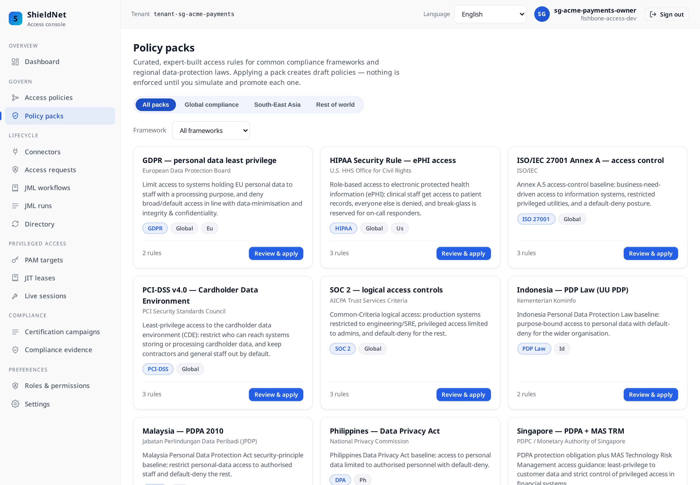

## The dashboard: who can reach what

After simulate-and-promote, the workspace has **6 active policies, 0 drafts**.
The dashboard is deliberately blunt: "Who can reach what — and what still needs
testing before rollout."

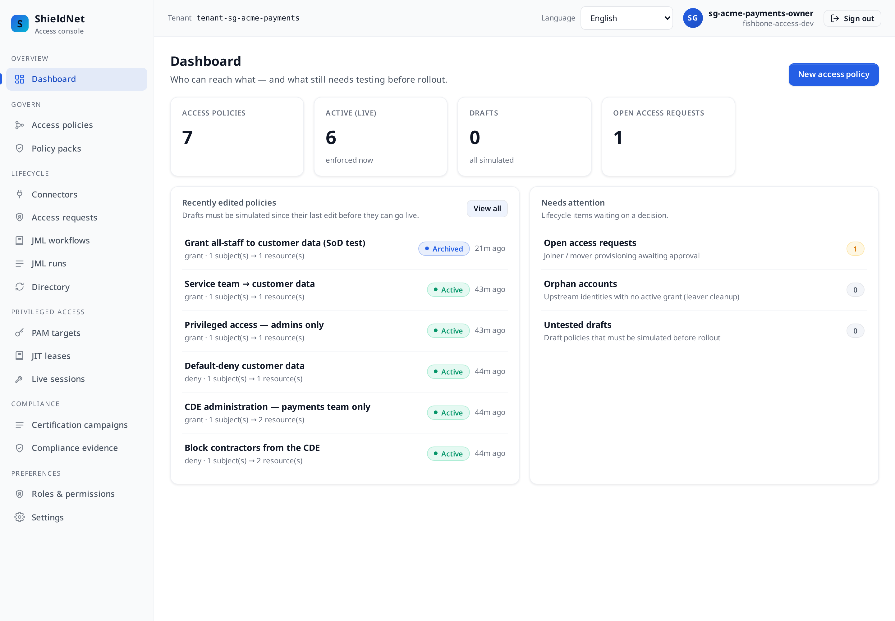

The policy list shows the mix the two packs produced — grants for the
service-team and platform-admin paths, and **default-deny** rows that are the
spine of the PDPA posture:

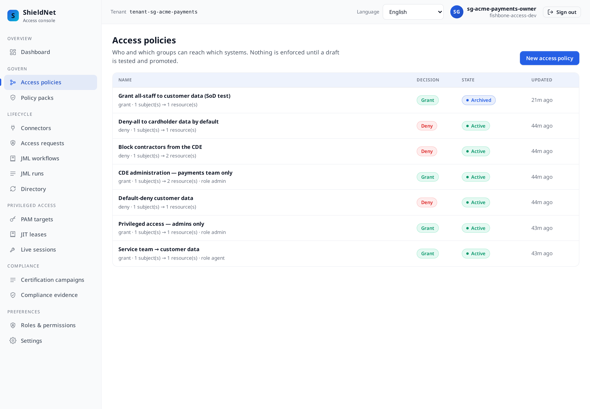

Every one of those promotions is gated. Promotion is the **strongest gate in the
API**: RBAC permission **+** a session MFA claim **+** a *fresh* step-up TOTP code
(RFC 6238, 30-second period, anti-replay). The seed paces promotions to the rate
the security model genuinely allows — it does not weaken the verifier to go
faster.

## The lifecycle leaves evidence — as a side effect

Acme then runs the access lifecycle: privileged ledger-admin and reconciliation
requests are approved and provisioned, a PCI CDE audit request is filed, a MAS
TRM privileged-access review runs, and a PCI-DSS certification campaign closes.
None of this is "compliance work" bolted on — it's normal operations, and the
evidence falls out of it.

The MAS TRM review is real and it actually **revoked** a grant
([`s1-sg-acme-payments-review-report.json`](../artifacts/payloads/s1-sg-acme-payments-review-report.json)):

```json
{
  "report": {
    "name": "Q2 2026 MAS TRM privileged-access review",
    "total": 2, "certified": 1, "revoked": 1, "escalated": 0, "pending": 0,
    "state": "active"
  }
}
```

The PCI-DSS certification campaign closed with a revoke too — every item decided
([`s1-sg-acme-payments-campaign-report.json`](../artifacts/payloads/s1-sg-acme-payments-campaign-report.json)):

```json
{
  "name": "Q2 2026 PCI-DSS v4 cardholder-data certification",
  "framework": "PCI-DSS", "state": "closed",
  "all_decided": true, "total": 1, "certified": 0, "revoked": 1, "overdue": false
}
```

## Employee-initiated requests are risk-scored before a human looks

Acme's access-request queue is where least-privilege becomes a day-to-day
workflow rather than a policy document. An employee files a request; the control
plane scores it **before** an approver ever sees it. Here is the auditor's
quarterly CDE request, with the verbatim risk verdict the API attaches
([`s1-sg-acme-payments-request-risk.json`](../artifacts/payloads/s1-sg-acme-payments-request-risk.json)):

```json
{
  "request": { "resource_ref": "cde:pci-scope", "role": "auditor", "state": "approved",
               "justification": "Quarterly PCI-DSS audit requires read access to the CDE for evidence sampling." },
  "risk": {
    "score": "low", "recommendation": "auto_approve_eligible",
    "source": "ai_agent", "degraded": false,
    "factors": ["baseline_low_risk"],
    "rationale": "rule-based risk=low from 1 factor(s)",
    "inputs": { "ai_tier": "deterministic", "duration_hours": 48,
                "resource_ref": "cde:pci-scope", "role": "auditor" }
  }
}
```

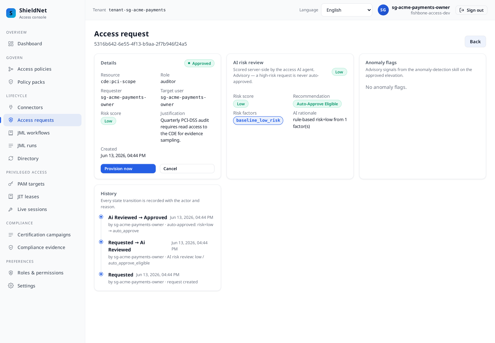

Read that honestly. The risk record is **real** and — unlike the first cut of this
series — it is now an actual **agent verdict**: `source` is `ai_agent` and
`degraded` is `false`, because the AI risk agent is online over A2A mTLS in this
seed. For this read-only `auditor` request the agent's deterministic tier returns
`low` / `auto_approve_eligible` from a single `baseline_low_risk` factor, and the
`inputs` it scored on (resource, role, duration) are recorded alongside the
verdict. The fail-closed path is still the design: were the agent unreachable,
`source` would read `fallback`, `degraded` `true`, and the route would pin to
`needs_review` — an unavailable risk engine must never silently auto-approve. The
queue shows the per-request tiering at a glance:

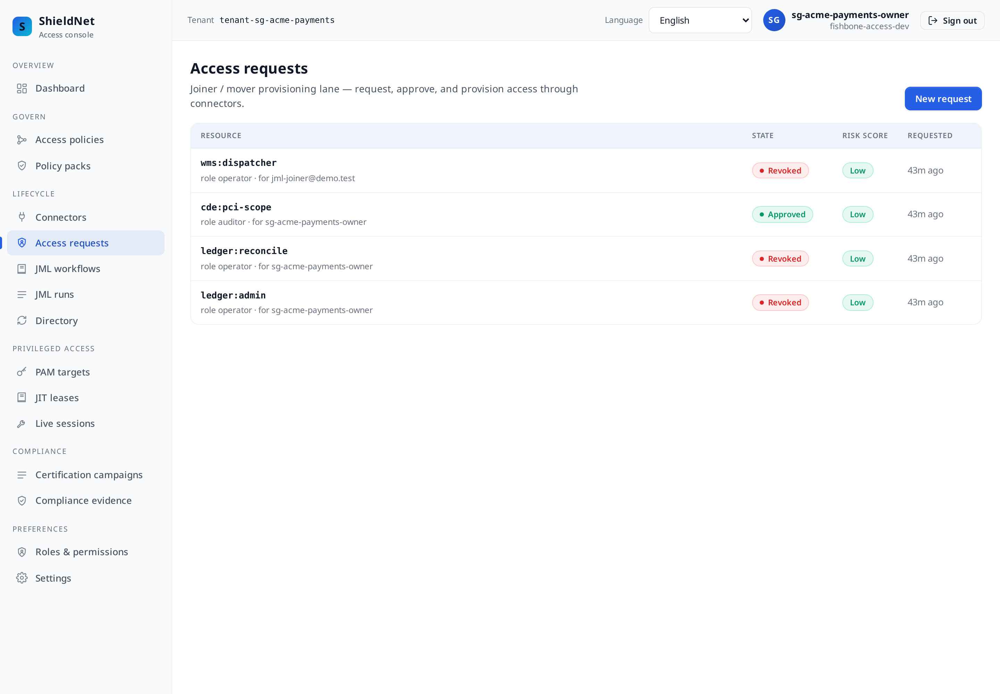

## Privileged access to the ledger: a just-in-time lease

Acme's core ledger is not a SaaS app — it's a **PostgreSQL database** and the
**Linux host** it runs on. Standing admin credentials to either are exactly what
MAS TRM §11 exists to prevent. So Acme registers them as **PAM targets** rather
than handing out passwords
([`s1-sg-acme-payments-pam-targets.json`](../artifacts/payloads/s1-sg-acme-payments-pam-targets.json)):

```json
[
  { "name": "Core ledger (PostgreSQL)", "protocol": "postgres",
    "address": "ledger-db-1.acme-pay.internal:5432", "username": "ledger_admin",
    "require_mfa": true, "lease_ttl_seconds": 1800 },
  { "name": "Ledger DB host (prod-sg-1)", "protocol": "ssh",
    "address": "ledger-db-1.acme-pay.internal:22", "username": "ops",
    "require_mfa": true, "lease_ttl_seconds": 1800 }
]
```

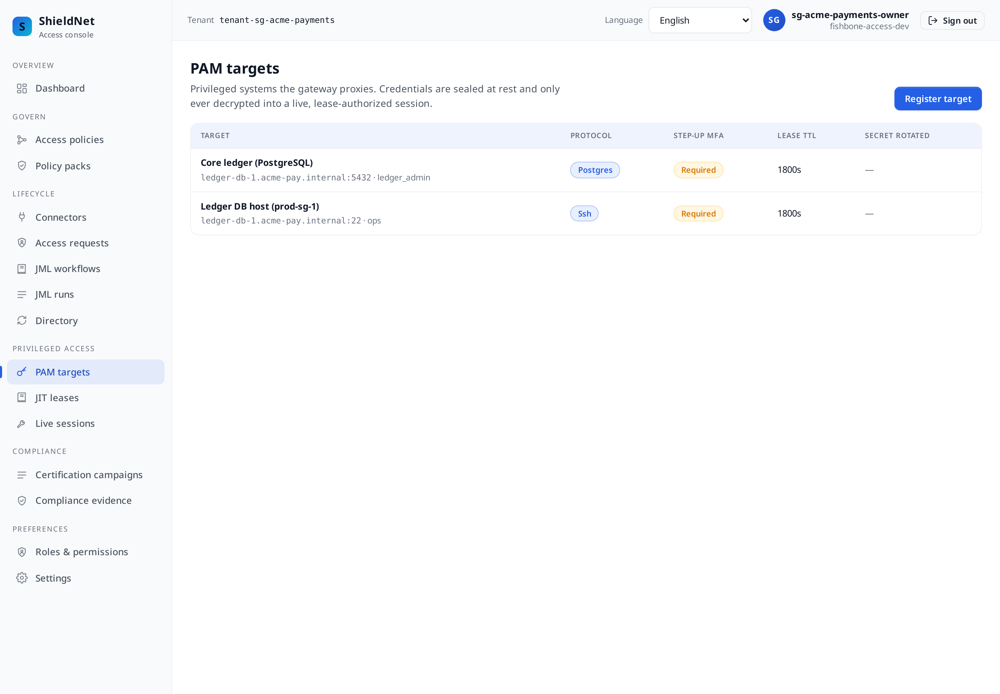

Nobody holds a standing credential. To touch the ledger, an operator requests a
**just-in-time lease**; a sponsor approves it under **step-up MFA**; the control
plane mints a short-lived connect-token and the lease **expires automatically**
30 minutes later. The lease carries its own **agent** risk verdict
([`s1-sg-acme-payments-pam-leases.json`](../artifacts/payloads/s1-sg-acme-payments-pam-leases.json)):

```json
{
  "state": "expired", "subject": "sg-acme-payments-owner",
  "requested_by": "sg-acme-payments-owner", "approved_by": "sg-acme-payments-owner",
  "granted_at": "2026-06-13T16:44:31.360978Z", "expires_at": "2026-06-13T17:14:31.360978Z",
  "requested_ttl_seconds": 1800,
  "risk_level": "low", "risk_degraded": false, "risk_factors": ["baseline_low_risk"],
  "risk_reason": "rule-based risk=low from 1 factor(s)"
}
```

This capture was taken after the 30-minute ceiling, so the lease reads `expired` —
the terminal state the control plane reaches **on its own**, not by an operator
revoking it. That is the point: standing credentials never lapse, JIT leases do.

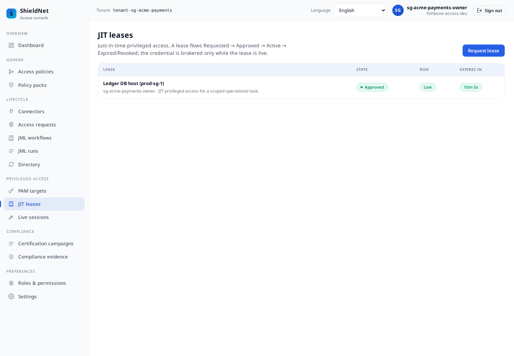

This is the full *lease* lifecycle — request → approve (step-up) → mint → expire
— and every step lands on the evidence chain (`pam.target.created`,
`pam.lease.requested`, `pam.lease.approved`, `pam.connect_token.minted`). But the
lease is only half the story. Acme also opens a **recorded privileged session**
against a registered bastion target: the JIT connect-token is redeemed, the
operator's commands run through the **same `IORecorder` the live gateway uses**,
and the session is **closed** with its recording anchored. `pam_sessions = 1` for
this workspace, and the framed transcript is retrievable over
`GET /pam/sessions/27eeb988-0912-4234-b407-46712aae6d7b/replay`:

```json
{ "frames": [
  { "direction": "control", "payload": "recorded privileged session ops@ledger-bastion.acme-pay.internal:22" },
  { "direction": "input",  "payload": "whoami\r\n" },
  { "direction": "output", "payload": "ops\r\n" },
  { "direction": "input",  "payload": "sudo systemctl status ledger-postgres\r\n" },
  { "direction": "output", "payload": "\u25cf ledger-postgres.service - active (running)\r\n" },
  { "direction": "input",  "payload": "psql -At -c \"select count(*) from postings where settled_at is null\"\r\n" },
  { "direction": "output", "payload": "0\r\n" },
  { "direction": "input",  "payload": "exit\r\n" } ] }
```

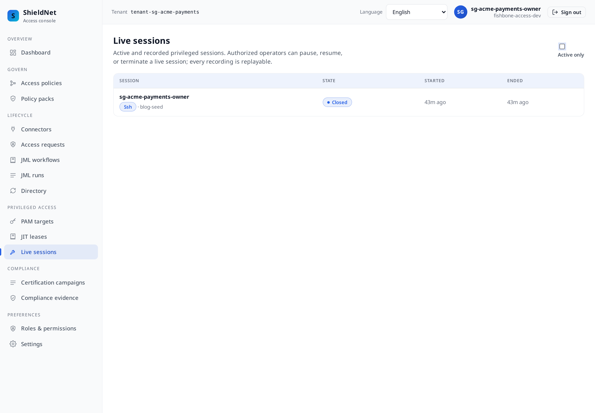

This is what flips `CC6.7` / ISO `A.8.2` / PCI-DSS `10.2` to **covered**: the
session is recorded, its SHA-256 is on the hash chain, and an auditor can replay
it. The **honest residual** (see "where we fall short"): the commands above are
seeded representative I/O against a bastion target — the self-contained demo has
no live SSH daemon — so this proves the **recording-and-replay pipeline
end-to-end and the chained, retrievable artifact**, not keystrokes captured off a
production box. Pointed at a reachable upstream through the in-path gateway, the
exact same `IORecorder` captures real bytes.

## Stopping a catastrophic grant *before* it happens

MAS TRM segregation says the identity that administers the ledger must not also
sign off reconciliation. Acme encodes that as a **separation-of-duties rule**
([`s1-sg-acme-payments-sod-rules.json`](../artifacts/payloads/s1-sg-acme-payments-sod-rules.json)):

```json
{
  "name": "Ledger admin must not also approve reconciliation",
  "severity": "critical",
  "resource_a": "ledger:admin",     "role_a": "operator",
  "resource_b": "ledger:reconcile", "role_b": "operator",
  "description": "MAS TRM segregation: the same identity cannot both administer the ledger and sign off reconciliation."
}
```

Before any grant that *would* combine those roles, the access **simulation**
runs the toxic-combination check and marks the change `catastrophic` — with the
exact violated rule, not a vague warning
([`s1-sg-acme-payments-sod-simulation.json`](../artifacts/payloads/s1-sg-acme-payments-sod-simulation.json)):

```json
{
  "impact": {
    "action": "grant", "catastrophic": true,
    "catastrophic_reasons": ["introduces high/critical separation-of-duties toxic combination(s)"],
    "sod_violations": [
      { "subject": "sg-acme-payments-owner", "severity": "critical", "introduced": true,
        "held":        { "resource": "ledger:admin",     "role": "operator" },
        "conflicting": { "resource": "ledger:reconcile", "role": "operator" },
        "rule_name": "Ledger admin must not also approve reconciliation" }
    ]
  }
}
```

The pre-commit check is the *front* door. The *standing* door is a sweep over
grants that already exist — because toxic combinations also accrete over time, one
approved grant at a time, with no single change ever looking catastrophic. In this
seed a dedicated contractor subject is granted **both** halves of the rule as
live, approved grants, and the anomaly sweep records the standing violation and
its disposition — `sod_anomalies = 1`
([`s1-sg-acme-payments-sod-anomalies.json`](../artifacts/payloads/s1-sg-acme-payments-sod-anomalies.json)):

```json
{ "detail": { "anomaly_kind": "sod_violation",
    "held":        { "resource": "ledger:admin",     "role": "operator" },
    "conflicting": { "resource": "ledger:reconcile", "role": "operator" },
    "rule_name": "Ledger admin must not also approve reconciliation" } }
```

That standing detection is what flips SOC 2 `CC7.3` ("anomalous access detected
and dispositioned") to **covered**. The honest line still holds: this is a
**declared-rule** check, not graph-mined discovery of *unknown* conflicts the way
SailPoint/Saviynt market it — see "where we fall short."

The same guardrail runs on **policy** changes. Here the console's simulate step
catches a grant-vs-deny conflict in the editor before promotion:

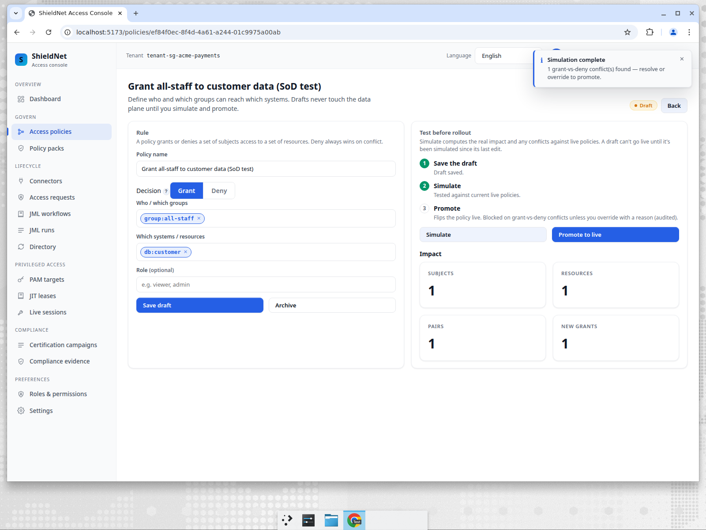

And promotion itself is the strongest gate — a fresh step-up TOTP, refused
otherwise:

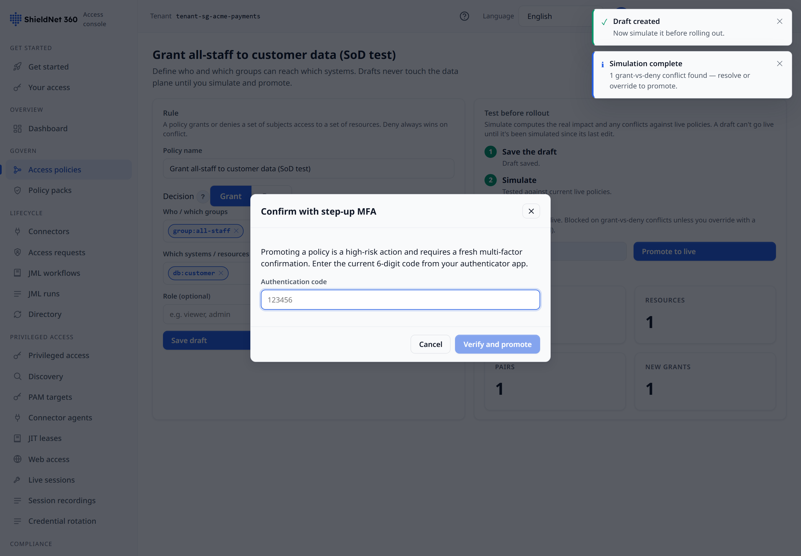

## Contractor access, time-boxed by construction

Acme's PCI-DSS 11.3 penetration test and a 6-week payment-rails integration both
need *external* people in scope — exactly the access that becomes a standing
orphan if nobody remembers to remove it. Contractor grants make the expiry
**mandatory** and the sponsor **named**, and the history is non-trivial: one
grant is still `active` (expires in September), the other was **revoked early**
([`s1-sg-acme-payments-contractor-grants.json`](../artifacts/payloads/s1-sg-acme-payments-contractor-grants.json)):

```json
[
  { "display_name": "PayTech integration contractor", "contractor_user_id": "ext-paytech-integrator@vendor.example",
    "resource_ref": "ledger:reconcile", "role": "operator", "sponsor_id": "sg-admin",
    "state": "active", "expires_at": "2026-09-04T02:14:02Z",
    "justification": "6-week payment-rails integration; sponsor: Head of Platform." },
  { "display_name": "External penetration tester", "contractor_user_id": "ext-pentest@security.example",
    "resource_ref": "cde:pci-scope", "role": "auditor", "sponsor_id": "sg-security_admin",
    "state": "revoked", "expires_at": "2026-06-22T02:14:02Z",
    "justification": "PCI-DSS 11.3 annual penetration test, read-only CDE." }
]
```

Every transition — `contractor.grant.requested`, `.approved`, `.revoked` — is on
the same chain as everything else, so "who let the pentester in, and when were
they cut off?" is a query, not an archaeology project.

## The compliance view: control coverage you didn't hand-assemble

Open **Compliance evidence** and pick PCI-DSS. The system maps the audit chain
onto framework controls. With the recorded session and the in-chain export now
present, all five map to evidence — including `10.2`, which the first cut of this
post showed uncovered:

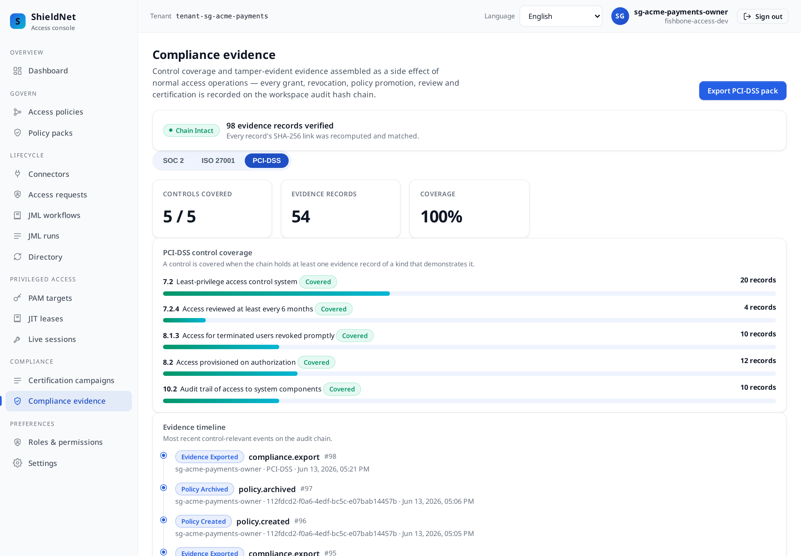

This is the verbatim coverage the export embeds
([`s1-sg-acme-payments-evidence-pack-manifest.json`](../artifacts/payloads/s1-sg-acme-payments-evidence-pack-manifest.json)):

```json
{
  "coverage": {
    "framework": "PCI-DSS",
    "controls_covered": 5, "controls_total": 5, "evidence_total": 50,
    "controls": [
      { "id": "7.2",   "covered": true, "evidence_count": 19, "title": "Least-privilege access control system" },
      { "id": "7.2.4", "covered": true, "evidence_count": 4,  "title": "Access reviewed at least every 6 months" },
      { "id": "8.1.3", "covered": true, "evidence_count": 10, "title": "Access for terminated users revoked promptly" },
      { "id": "8.2",   "covered": true, "evidence_count": 12, "title": "Access provisioned on authorization" },
      { "id": "10.2",  "covered": true, "evidence_count": 8,  "title": "Audit trail of access to system components" }
    ]
  }
}
```

The same page also renders SOC 2's logical-access controls from the *same* chain
— one set of operations, mapped to multiple frameworks:

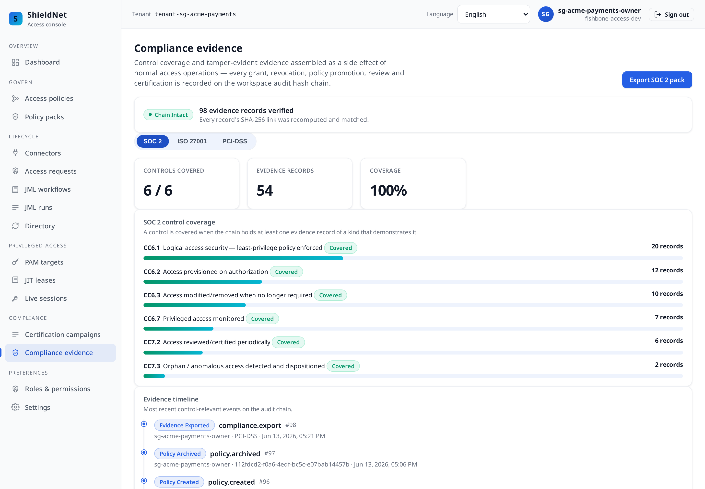

## Under the hood: the tamper-evident chain

The number that matters to an auditor is not "100 events" — it's that the **100
events form an unbroken hash chain**. Each record links to the previous by
SHA-256; the verifier recomputes every link
([`s1-sg-acme-payments-chain-verify.json`](../artifacts/payloads/s1-sg-acme-payments-chain-verify.json)):

```json
{ "length": 100, "ok": true, "status": "valid", "workspace_id": "7eb57816-3d54-4b9a-b095-a853acc1370a" }
```

When Acme exports the **PCI-DSS evidence pack**, the manifest carries a
`content_sha256` over the whole pack plus a per-file SHA-256, and the export
*itself* is step-up-MFA-gated and recorded back onto the chain. The pack is a
ZIP of newline-delimited JSON (`evidence.jsonl` with all 100 records,
`access-grants.jsonl`, `certification-*.jsonl`, `policies.jsonl`,
`pam-recordings.jsonl` for the recorded session, `chain-verification.json`, and an
auditor README). An auditor can re-hash the
files and match the manifest offline — no trust in Acme's word required.

## i18n is not an afterthought

The same seeded data re-renders in 12 locales. Here is Acme's dashboard in
Simplified Chinese — the *same* 6 policies, same counts, fully translated chrome:

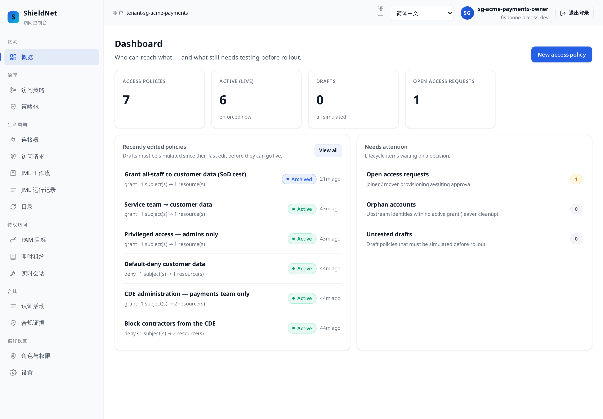

For a Singapore SME with a multilingual workforce, that is the difference between
a control an operator actually understands and one they click through blindly.

## Where we fall short

This cut closes four of the gaps the first version of this post flagged — and is
precise about the line each one stops at:

- **Privileged-session monitoring is now *covered* — with a stated boundary.**
  `pam_sessions = 1`: Acme opens a real JIT-leased session that is recorded
  through the production `IORecorder`, anchored on the chain, and replayable over
  the API, so `CC6.7` / ISO `A.8.2` / PCI-DSS `10.2` read covered. The residual:
  the recorded commands are seeded representative I/O against a bastion target —
  the demo has no live SSH daemon — so it proves the **recording + replay
  pipeline and the chained artifact**, not keystrokes captured off a production
  box. Pointed at a reachable upstream through the in-path gateway, the same code
  records real bytes.
- **The SoD anomaly is now *standing*, not just simulated.** `sod_anomalies = 1`:
  a subject really holds both halves of the toxic combination and the sweep
  detects + dispositions it (`CC7.3` covered). Still honest: this is a
  **declared-rule** check, not graph-mined discovery of *unknown* conflicts.
- **AI risk scoring is real, not degraded.** Verdicts show `source: ai_agent`,
  `degraded: false`. The fail-closed `needs_review` safety net remains the
  behaviour *when the agent is offline* — it is the floor, not the demo's state.
- **Tamper-evident export (`A.8.15` / PCI-DSS 10.2 export evidence) is in-chain.**
  The pack is exported before the chain is snapshotted, so `evidence_exported` is
  part of the verified chain.

What genuinely stays uncovered — and a self-contained demo cannot close:

- **App-native read logging.** PCI-DSS 10.2 over reads performed *directly inside*
  the core-banking app (not through our gateway) still needs the app's own audit
  trail or a SIEM. We prove the access was authorised, time-boxed, **and** (now)
  recorded when brokered — we do not see a read an admin makes on a box we never
  brokered.
- **Connector depth is shallow in-demo.** Stripe / Salesforce / GitHub register
  but sit `pending` — the catalogue breadth (201 providers) is real, but the
  deep provisioning operations per provider are not all production-grade yet.

## How a buyer should compare this

For an SME like Acme, the honest competitive picture:

| Capability | fishbone-access | Okta IGA | SailPoint | CyberArk |
| --- | --- | --- | --- | --- |
| Jurisdiction packs (PDPA/MAS TRM out of the box) | ✅ curated | ⚠️ build your own | ⚠️ build your own | ❌ |
| Tamper-evident, re-verifiable evidence export | ✅ hash-chain + manifest | ⚠️ reports, not chained | ⚠️ reports | ⚠️ |
| Step-up MFA on promote, export **and** lease approval | ✅ | ⚠️ on some admin actions | ⚠️ | ✅ |
| Privileged JIT **lease** lifecycle (request→approve→expire) | ✅ governed + chained | ⚠️ (needs Okta PAM) | ⚠️ | ✅ |
| Privileged **session recording** (replayable, chained) | ⚠️ recorded + replayable; demo upstream is a bastion, not a live box | ❌ (needs Okta PAM) | ❌ | ✅ core strength (live keystrokes) |
| SoD toxic-combination check (pre-commit **and** standing sweep) | ✅ `catastrophic` + standing anomaly | ⚠️ | ✅ deepest analytics | ❌ |
| Time-boxed contractor access (sponsor + auto-expiry) | ✅ first-class | ⚠️ via lifecycle | ✅ | ❌ |
| AI-assisted risk on requests/leases (real verdict, fail-safe when offline) | ✅ `source: ai_agent` | ⚠️ | ✅ | ❌ |
| Access certifications / campaigns | ✅ | ✅ | ✅ deepest (SoD analytics) | ⚠️ |
| SME pricing / time-to-value | ✅ single console, days | ⚠️ per-user, weeks | ❌ enterprise, months | ❌ enterprise |

**The honest read:** we now ship a real SoD toxic-combination check that fires at
simulation time (the `catastrophic` verdict above) **and** a standing anomaly
sweep, a first-class contractor lifecycle, a governed JIT privileged-lease flow,
and a **recorded, replayable, chain-anchored** privileged session — so the gap to
SailPoint, Saviynt and CyberArk is narrower than it was. But they still
out-analyse us on entitlement-mining and deep certifications *at scale*, and
CyberArk owns privileged *session* control against **live** upstreams outright:
our recording proves the pipeline end-to-end against a bastion target, but if
Acme's core risk were capturing an admin's live keystrokes in a reachable
core-banking box at scale, CyberArk is still the heavier tool. Where fishbone-access wins for an SME
is **time-to-defensible-evidence**: the PDPA + MAS TRM pack, the hash-chained
chain, and a re-verifiable PCI-DSS export are there on day one, in one console,
without an integration project. For a 40-person payments shop that needs to pass
an assessment next quarter — not stand up an IGA program over two years — that
trade is usually the right one. Just don't buy us expecting CyberArk's session
vault; buy the tool whose strength matches your top risk.

---

*Next: [Post 2 — US healthcare](02-us-healthcare-hipaa-ccpa.md), where the leaver
kill switch fires for real — and partially fails, on purpose, in the demo.*
