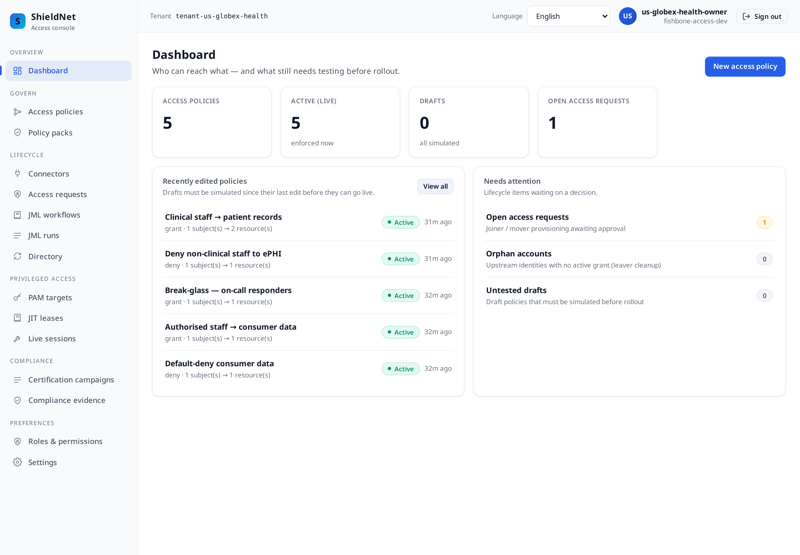
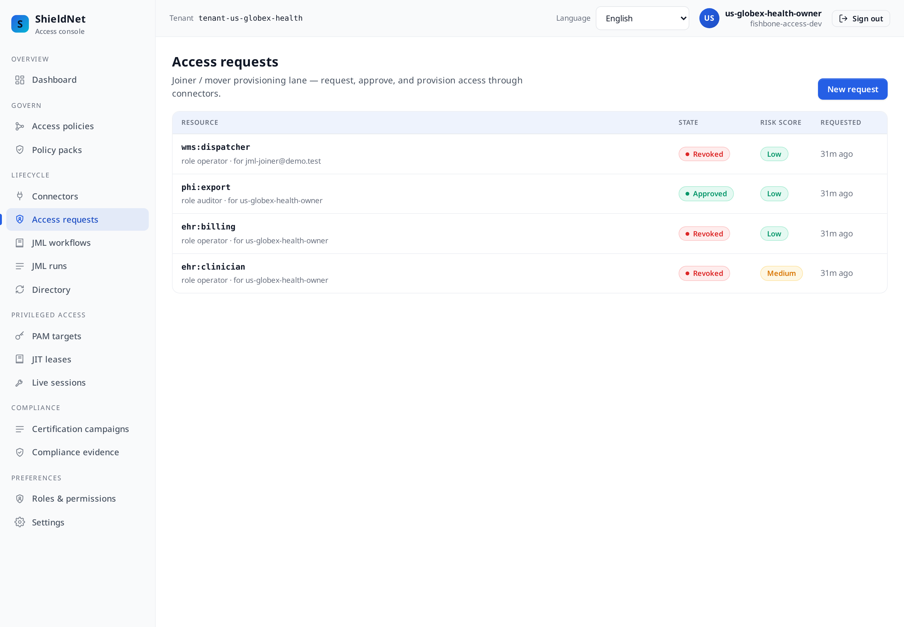
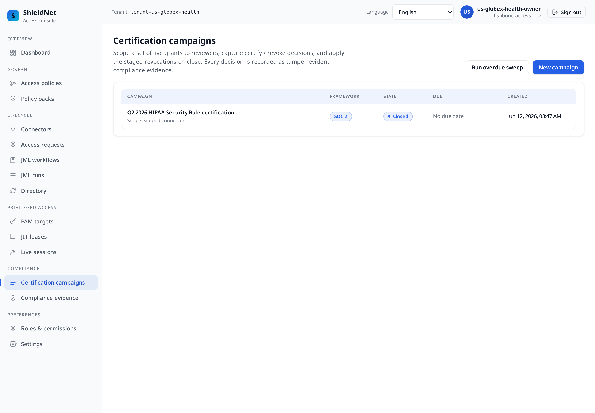
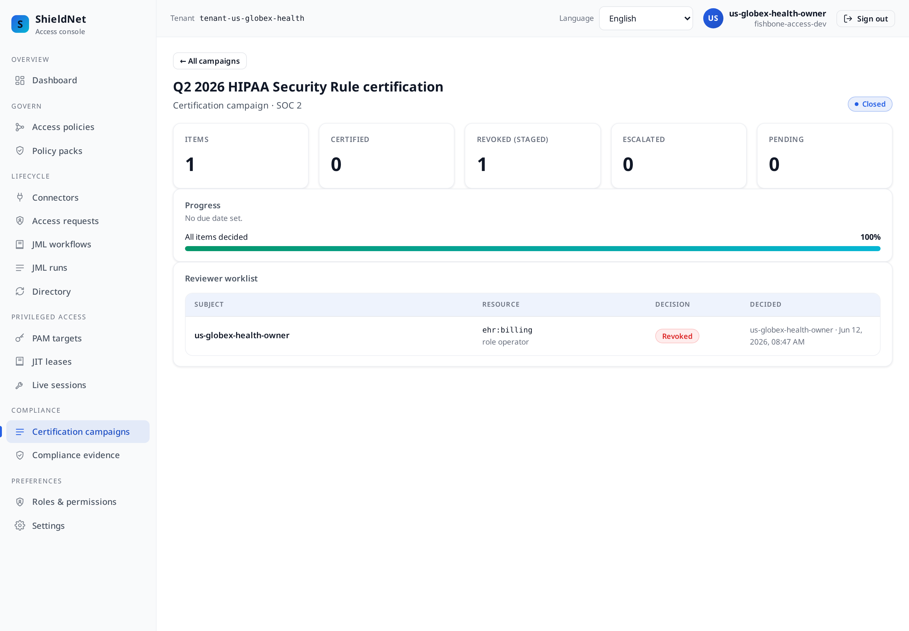
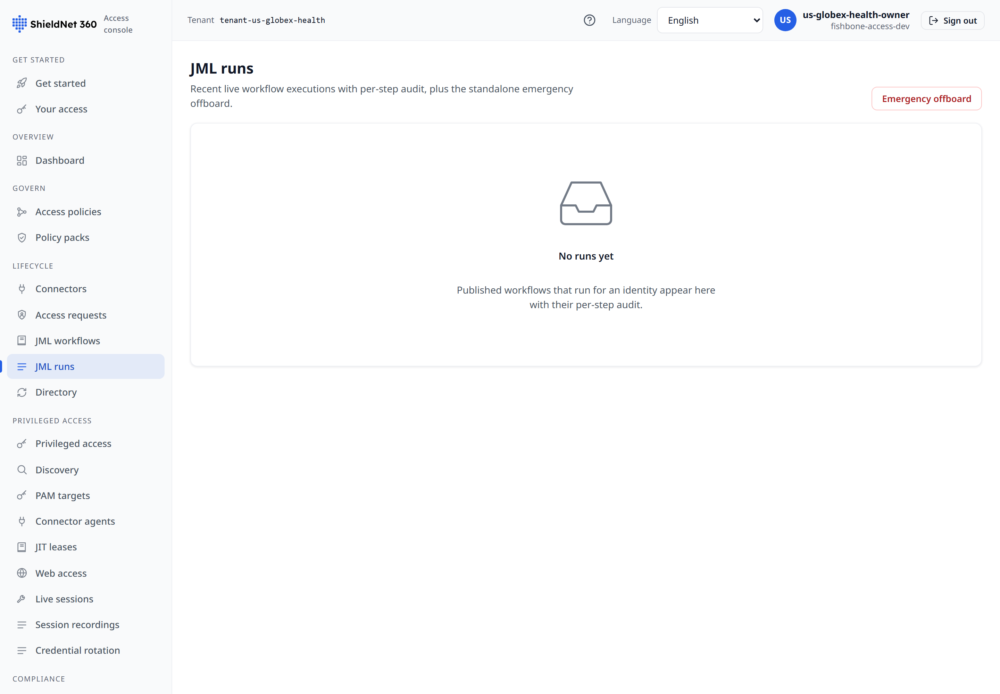
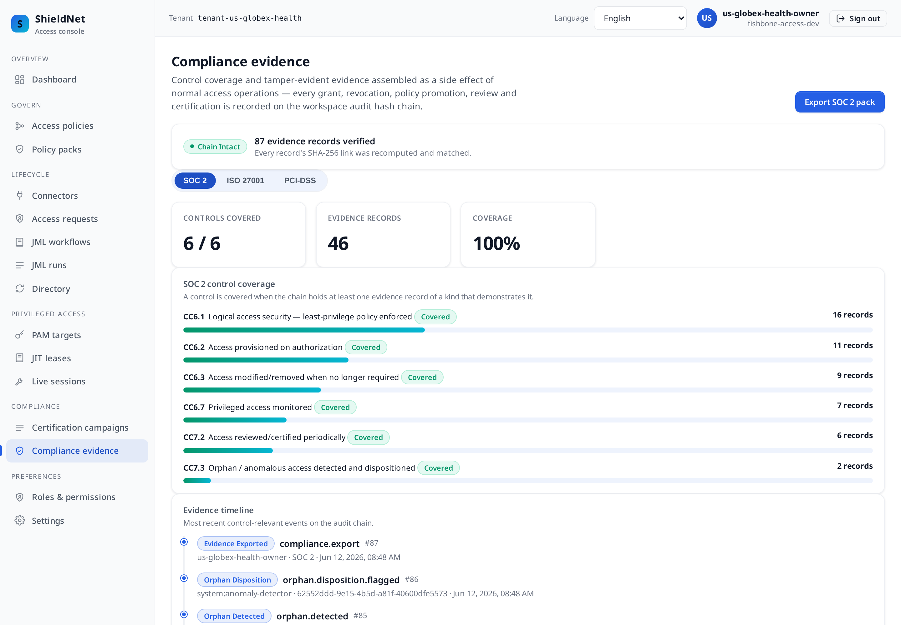

# Post 2 — US healthcare: HIPAA minimum-necessary, CCPA, and a leaver kill switch that fails on purpose

> Workspace: **Globex Health** (`us`, healthcare) · Personas: **Sofia**
> (security engineer), **Dmitri** (IT admin). Payloads are verbatim from
> [`../artifacts/payloads/`](../artifacts/payloads/).

## The business problem

Globex Health is a digital-health SME holding electronic protected health
information (ePHI). Two regimes apply:

- **HIPAA Security Rule** — the *minimum-necessary* standard: a workforce member
  may touch only the ePHI their job requires, and access for terminated users
  must be revoked promptly.
- **CCPA / CPRA** — California consumers can demand to know and delete their
  data, which means Globex must be able to find *who can reach* a consumer
  record and prove it was provisioned on authorization.

Sofia owns the part everyone gets wrong: the **leaver**. A clinician who quits on
Friday must be off every system by Friday evening — SSO, document store, and the
EHR role — or it's a reportable gap. Dmitri wants this to happen without a
bespoke offboarding script per app.

## The dashboard

Globex seeds to **5 active policies, 0 drafts**, built from the
`hipaa-security-rule` and `us-ccpa-cpra` packs over a lean fabric: **Okta**
(workforce SSO), **Box** (clinical documents), and a **manual Epic EHR**
clinical-role target — because the EHR has no self-service provisioning API, the
manual connector fulfils it locally and still records the lifecycle.



## Access requests carry risk

The access-request queue is where minimum-necessary becomes operational. Each
request is risk-scored before a human ever sees it:



The HIPAA ePHI access review then runs over the resulting grants and makes real
decisions — one certified, one revoked
([`s2-us-globex-health-review-report.json`](../artifacts/payloads/s2-us-globex-health-review-report.json)):

```json
{
  "report": {
    "name": "Q2 2026 HIPAA ePHI access review",
    "total": 2, "certified": 1, "revoked": 1, "escalated": 0, "pending": 0,
    "state": "active"
  }
}
```

The certification campaign closes with every item decided
([`s2-us-globex-health-campaign-report.json`](../artifacts/payloads/s2-us-globex-health-campaign-report.json)):

```json
{
  "name": "Q2 2026 HIPAA Security Rule certification",
  "state": "closed", "all_decided": true, "total": 1, "revoked": 1, "overdue": false
}
```

In the console, that campaign is a worklist a reviewer actually works: each
in-scope grant gets a **certify** or **revoke** decision, and closing the
campaign applies the staged revocations. Here is the closed HIPAA campaign and
its single decided item — `ehr:clinician`, **revoked**, decided and timestamped:





This is the **access-certification** journey regulators ask about: a scoped
review, a recorded human decision per item, and the revocation actually applied —
not a screenshot of a spreadsheet someone signed.

## A risk-scored request for the most sensitive action

Globex's hardest access to govern is a **PHI export** — fulfilling a CCPA/CPRA
data-subject request means letting someone pull consumer records out. So that
request is risk-scored before anyone approves it
([`s2-us-globex-health-request-risk.json`](../artifacts/payloads/s2-us-globex-health-request-risk.json)):

```json
{
  "request": { "resource_ref": "phi:export", "role": "auditor", "state": "approved",
               "justification": "CCPA/CPRA consumer data-subject access request fulfilment." },
  "risk": { "score": "low", "recommendation": "auto_approve_eligible",
            "source": "ai_agent", "degraded": false, "factors": ["baseline_low_risk"] }
}
```

As in Post 1, the verdict is a **real agent verdict** (`source: ai_agent`,
`degraded: false`) now that the risk agent is online. The fail-safe `needs_review`
default is still what fires *if* the agent is unreachable — a fail-open on a PHI
export would be exactly the wrong default — but it is the floor, not this seed's
state.


## Privileged access to the ePHI datastore — without standing credentials

The patient records do not live in a SaaS app; they live in a **PostgreSQL
database** behind a clinical app server. Globex registers both as PAM targets
with a **15-minute** lease ceiling — tighter than Acme's, because this is ePHI
([`s2-us-globex-health-pam-targets.json`](../artifacts/payloads/s2-us-globex-health-pam-targets.json)):

```json
[
  { "name": "ePHI datastore (PostgreSQL)", "protocol": "postgres",
    "address": "ehr-db-1.globex.internal:5432", "username": "phi_reader",
    "require_mfa": true, "lease_ttl_seconds": 900 },
  { "name": "EHR app server (clinical-app-1)", "protocol": "ssh",
    "address": "clinical-app-1.globex.internal:22", "username": "ehr-ops",
    "require_mfa": true, "lease_ttl_seconds": 900 }
]
```

An engineer who needs to touch the ePHI store requests a JIT lease, a sponsor
approves under step-up MFA, a short-lived token is minted, and it expires in 15
minutes. Those `pam.target.created` / `pam.lease.approved` /
`pam.connect_token.minted` events are visible on the compliance evidence timeline
below. And this time the lease is followed by a **recorded session**: Globex opens
a JIT-leased session against the EHR bastion, the operator's commands run through
the production `IORecorder`, and the recording is closed and anchored —
`pam_sessions = 1`, retrievable over
`GET /pam/sessions/52616c51-2a26-495f-ab2d-a284c8ad704b/replay`. That flips HIPAA
privileged-access monitoring (`CC6.7` / ISO `A.8.2`) to **covered**. The honest
residual is unchanged from Post 1: the recorded I/O is representative commands
against a bastion target, proving the recording-and-replay pipeline, not
keystrokes captured off a live ePHI box (see "where we fall short").

## Minimum-necessary as a hard rule: separation of duties

HIPAA minimum-necessary is also a *separation* problem: a clinician should not
also hold the billing-export role. Globex encodes that, and the access simulation
marks the combination `catastrophic` before it can be granted
([`s2-us-globex-health-sod-simulation.json`](../artifacts/payloads/s2-us-globex-health-sod-simulation.json)):

```json
{ "impact": { "catastrophic": true,
    "sod_violations": [
      { "rule_name": "Clinician role must not hold billing export", "severity": "high",
        "held":        { "resource": "ehr:clinician", "role": "operator" },
        "conflicting": { "resource": "ehr:billing",   "role": "operator" } }
    ] } }
```

And because conflicts also accrete after the fact, a standing sweep records the
*live* violation when a subject already holds both halves — `sod_anomalies = 1`,
which is what flips `CC7.3` to covered
([`s2-us-globex-health-sod-anomalies.json`](../artifacts/payloads/s2-us-globex-health-sod-anomalies.json)).
It is still a declared-rule check, not graph-mined discovery.

## A contractor with an expiry built in

Globex outsources medical coding. That vendor needs the billing role — and
*only* until the engagement ends. A contractor grant makes the sponsor explicit
and the access self-terminating
([`s2-us-globex-health-contractor-grants.json`](../artifacts/payloads/s2-us-globex-health-contractor-grants.json)):

```json
{ "display_name": "Medical-coding vendor", "contractor_user_id": "ext-coding-vendor@billing.example",
  "resource_ref": "ehr:billing", "role": "operator", "sponsor_id": "us-admin", "state": "active" }
```

## The leaver kill switch — and why it *should* report failure here

This is the most honest screen in the whole series. When a leaver is processed,
the kill switch does not "delete a user." It **sweeps every layer** that can cut
off access and records each layer's result on the audit chain. Here are the
verbatim leaver events from Globex's evidence chain
([`s2-us-globex-health-evidence.json`](../artifacts/payloads/s2-us-globex-health-evidence.json),
records 54–59):

```
jml.leaver.grant_revoke.done          ← local grants revoked          ✅
jml.leaver.team_remove.done           ← removed from teams            ✅
jml.leaver.iam_core_disable.skipped   ← no iam-core identity to disable
jml.leaver.session_revoke.failed      ← Okta session revoke           ❌
jml.leaver.scim_deprovision.failed    ← Box SCIM deprovision          ❌
jml.leaver.identity_disable.done      ← local identity disabled       ✅
```

Two layers **failed**, and that is correct. In this self-contained demo the live
SaaS connectors (Okta, Box) carry *placeholder* credentials and there is no real
upstream to reach — so `session_revoke` and `scim_deprovision` genuinely cannot
confirm revocation. The kill switch **still** revokes the grants and disables the
identity locally, and it records the *full layered result* including the
failures. It reports **partial failure** rather than a green check it cannot
honestly give.

A system that printed "leaver complete ✅" here would be lying. fishbone-access
surfaces the partial result so Sofia knows exactly which upstream still needs a
manual cut-off. (Point the same connectors at real Okta/Box tenants with valid
credentials and those two lines flip to `.done`.)

The JML runs screen shows these joiner/mover/leaver sweeps as discrete,
identity-driven runs — the bridge between an HR/IdP change and the access fabric:



You can see the same layered events on the compliance evidence timeline in the
console (the `Kill Switch Fired` rows), each linked into the hash chain — the
PAM target/lease events from the section above appear on this same timeline:


## The compliance view

Globex's SOC 2 logical-access coverage from the same chain — provisioning,
review, revocation **and** the privileged-monitoring control now backed by the
recorded session:



## Where we fall short

Closed in this cut: **privileged-access monitoring** (`CC6.7` / `A.8.2`) is now
covered by a real recorded, replayable, chain-anchored session (`pam_sessions =
1`), and the **standing SoD anomaly** (`CC7.3`) fires for a subject that holds
both `ehr:clinician` and `ehr:billing` (`sod_anomalies = 1`). Risk verdicts are
real (`source: ai_agent`). What genuinely stays uncovered here — and matters most
for a healthcare buyer:

- **The two failed kill-switch layers are real gaps in the demo**, not cosmetic.
  Without real upstream credentials, fishbone-access cannot *prove* the Okta
  session and Box account were killed — it can only prove it tried and that the
  local grant is gone.
- **No ePHI *read* logging inside the app.** Our recorded session captures what an
  operator does **through a brokered lease**; it does not see a read a clinician
  performs *directly inside* the EHR over their own login. HIPAA audit-control
  (§164.312(b)) over the EHR itself still needs the EHR's audit log or a SIEM. We
  prove brokered access was authorised, reviewed and recorded — not every
  app-native read.
- **CCPA "delete" is not executed.** We can show *who could reach* a consumer
  record (the access surface) and that grants were certified/revoked; we do not
  run the data-deletion in the downstream app.
- **The recorded session is against a bastion, not a live ePHI box.** The session
  recording proves the pipeline end-to-end (lease → record → close → chain →
  replay); the demo has no live PostgreSQL upstream, so the captured commands are
  representative, not a `phi_reader`'s real SQL. In-path against a reachable
  database the same recorder captures the real wire.

## How a buyer should compare this

| Capability | fishbone-access | Okta IGA | SailPoint | StrongDM / Teleport |
| --- | --- | --- | --- | --- |
| Multi-layer leaver sweep with honest partial-failure report | ✅ records every layer | ⚠️ lifecycle, less explicit on partials | ✅ deep deprovision | ❌ (infra access only) |
| HIPAA/CCPA packs out of the box | ✅ | ⚠️ build your own | ⚠️ build your own | ❌ |
| Real-time SaaS deprovision at scale | ⚠️ depends on connector depth | ✅ Okta's home turf | ✅ | ❌ |
| JIT privileged **lease** to ePHI DB/SSH (request→approve→expire) | ✅ governed + chained | ⚠️ (Okta PAM add-on) | ⚠️ | ✅ |
| Privileged **session recording** (replayable, chained) | ⚠️ recorded + replayable; demo upstream is a bastion, not the live ePHI DB | ❌ | ❌ | ✅ core strength (live wire) |
| SoD: clinician-vs-billing toxic combo (pre-commit + standing) | ✅ `catastrophic` + standing anomaly | ⚠️ | ✅ deepest | ❌ |
| ePHI **app-native read** audit trail | ❌ needs SIEM/EHR log | ❌ | ❌ | ⚠️ session logs |

**The honest read:** if Globex's biggest exposure is the *SaaS* lifecycle — Okta
+ Box + an EHR — Okta IGA is the incumbent with the deepest native deprovision on
its own platform, and SailPoint goes deeper still on certification analytics. If
the exposure is engineers reaching the *database* that stores ePHI, Teleport or
StrongDM broker and record real wire traffic against live upstreams at a depth we
don't — our recording proves the pipeline against a bastion, not the live DB. Where fishbone-access wins
is the **honest, layered offboarding record** plus HIPAA/CCPA packs in one SME
console: the partial-failure report is exactly the artifact an auditor wants when
they ask "show me a termination." We'd rather show a true ❌ than a fake ✅ — and
that is the whole point of the chain.

---

*Next: [Post 3 — German retail](03-germany-retail-bdsg-c5-gdpr.md): four
overlapping frameworks over one connector fabric, rendered in German.*
