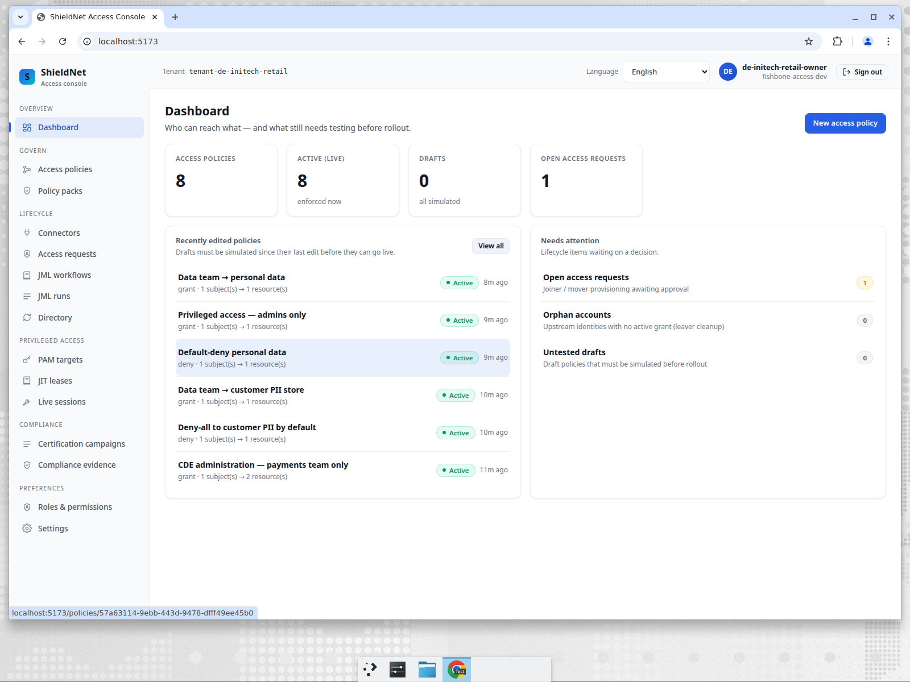
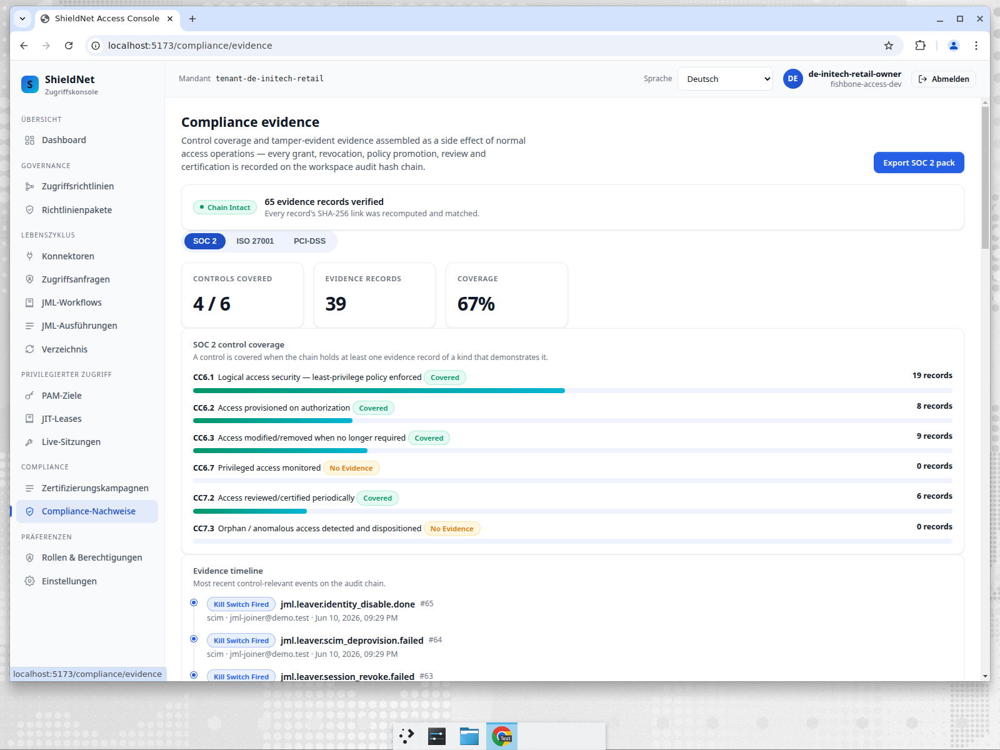

# Post 3 — German retail: four frameworks, one fabric, rendered in German

> Workspace: **Initech Retail** (`de`, retail) · Personas: **Priya**
> (compliance officer), **Dmitri** (IT admin). Payloads verbatim from
> [`../artifacts/payloads/`](../artifacts/payloads/).

## The business problem

Initech Retail is a German omni-channel retailer. It is in scope for **four**
overlapping regimes at once:

- **BDSG** — Germany's Federal Data Protection Act (the national complement to
  GDPR).
- **BSI C5** — the German cloud-security catalogue assurance customers ask for.
- **GDPR** — Article 15 access requests, least-privilege over personal data.
- **PCI-DSS v4.0** — because it takes card payments at POS and online.

Priya's nightmare is **duplication**: four auditors, four spreadsheets, the same
control re-evidenced four times. The whole pitch of fishbone-access here is that
*one* set of access operations should answer *all four* frameworks from *one*
evidence chain.

## The richest policy set in the series

Initech applies three packs — `de-bdsg-c5`, `gdpr-personal-data`, `pci-dss-v4` —
producing the largest active policy set of any workspace: **8 active policies, 0
drafts**, over a fabric of **GitHub** (e-commerce), **Datadog** (observability),
**Azure** (cloud infra), and a **manual SAP retail-POS** target.



The connector catalogue is faceted so Dmitri can find providers by category —
the live facets include `Cloud Infra`, `DevOps`, `Observability`, `ERP`,
`IAM/PAM`, `SIEM`, `Secrets/Vault`, and more
([`s3-de-initech-retail-catalogue-facets.json`](../artifacts/payloads/s3-de-initech-retail-catalogue-facets.json)).

## One chain, four framework maps

This is the headline. Initech ran *one* lifecycle — provision a store manager and
a CDE-maintenance engineer, file a GDPR Article 15 export request, run a BSI C5 +
GDPR review, close an ISO 27001 certification campaign. The **same 39 evidence
records** then project onto every framework's control set. Here is the console's
compliance view, in **German** (locale `de`) — the same data, translated chrome:



And the verbatim coverage maps, all from that one chain:

**SOC 2** ([`coverage-soc2`](../artifacts/payloads/s3-de-initech-retail-coverage-soc2.json)) — 4 / 6:
```json
[
  { "id": "CC6.1", "covered": true,  "evidence_count": 19, "title": "Logical access security — least-privilege policy enforced" },
  { "id": "CC6.2", "covered": true,  "evidence_count": 8,  "title": "Access provisioned on authorization" },
  { "id": "CC6.3", "covered": true,  "evidence_count": 9,  "title": "Access modified/removed when no longer required" },
  { "id": "CC6.7", "covered": false, "evidence_count": 0,  "title": "Privileged access monitored" },
  { "id": "CC7.2", "covered": true,  "evidence_count": 6,  "title": "Access reviewed/certified periodically" },
  { "id": "CC7.3", "covered": false, "evidence_count": 0,  "title": "Orphan / anomalous access detected and dispositioned" }
]
```

**ISO 27001 Annex A** ([`coverage-iso27001`](../artifacts/payloads/s3-de-initech-retail-coverage-iso27001.json)) — 3 / 5:
```json
[
  { "id": "A.5.15", "covered": true,  "evidence_count": 16, "title": "Access control policy" },
  { "id": "A.5.16", "covered": true,  "evidence_count": 7,  "title": "Identity lifecycle management" },
  { "id": "A.5.18", "covered": true,  "evidence_count": 14, "title": "Access rights provisioned, reviewed and removed" },
  { "id": "A.8.2",  "covered": false, "evidence_count": 0,  "title": "Privileged access rights monitored" },
  { "id": "A.8.15", "covered": false, "evidence_count": 0,  "title": "Tamper-evident logging" }
]
```

**PCI-DSS** ([`coverage-pci-dss`](../artifacts/payloads/s3-de-initech-retail-coverage-pci-dss.json)) — 4 / 5, same shape as Post 1.

The point is not the absolute numbers — it's that **one operation feeds three
maps**. Promoting the least-privilege policy lit `CC6.1` *and* `A.5.15` *and*
`7.2` simultaneously. Priya stops re-evidencing the same control four times.

## Where we fall short

The German view is brutally honest, and two gaps repeat across all four
frameworks:

- **`CC6.7` / `A.8.2` "privileged access monitored" — 0 records, every
  framework.** We govern *who is granted* privileged access and that it was
  reviewed; we do not *monitor the privileged session*. There is no PAM session
  proxy. This is the single most consistent gap in the series.
- **`CC7.3` "orphan / anomalous access detected" — 0 records.** Initech's orphan
  scan ran and found **0 orphans** — which is real, but it means there is no
  *dispositioned* orphan event to evidence the control. We detect orphans; we
  don't yet run behavioural anomaly analytics.
- **`A.8.15` "tamper-evident logging" reads uncovered — even though we *have* a
  hash chain.** The ISO mapping wants a specific evidence *kind* we don't emit
  for the chain-verification itself. That's a mapping gap on our side, and we
  show it as uncovered rather than quietly claiming the control. Honest, if
  slightly embarrassing.

## How a buyer should compare this

| Capability | fishbone-access | SailPoint | Saviynt | Okta IGA |
| --- | --- | --- | --- | --- |
| One chain → many framework maps (BDSG/C5/GDPR/PCI at once) | ✅ built-in | ⚠️ via config + add-ons | ⚠️ via config | ⚠️ limited |
| German + EU jurisdiction packs out of the box | ✅ `de-bdsg-c5`, GDPR | ⚠️ build your own | ⚠️ | ⚠️ |
| Separation-of-duties (SoD) analytics | ❌ | ✅ deepest | ✅ strong | ⚠️ |
| Orphan/anomaly **analytics** (beyond detection) | ❌ detect only | ✅ | ✅ | ⚠️ |
| Privileged session monitoring | ❌ | ⚠️ (partner) | ⚠️ (CPAM) | ❌ |
| Multi-locale (de native) | ✅ 12 locales | ⚠️ | ⚠️ | ✅ |
| SME fit (one console, weeks not quarters) | ✅ | ❌ enterprise | ❌ enterprise | ⚠️ |

**The honest read:** for a *large* retailer with thousands of roles and serious
toxic-combination risk, **SailPoint** or **Saviynt** are the right answer — their
SoD engines and orphan/anomaly analytics are years ahead of ours, and that is
exactly the `CC7.3` gap above. What they are *not* is fast or cheap for a
mid-size German retailer that needs BDSG + C5 + GDPR + PCI answered next quarter.
fishbone-access ships those four packs and the one-chain-many-maps projection on
day one, in German, in one console. Buy SailPoint if your risk is *toxic
combinations across thousands of entitlements*; buy us if your risk is *proving
four overlapping frameworks without a two-quarter integration project*.

---

*Next: [Post 4 — Vietnam logistics](04-vietnam-logistics-pdpd-decree13.md): the
"day one" story in an emerging-compliance market, in Vietnamese.*
