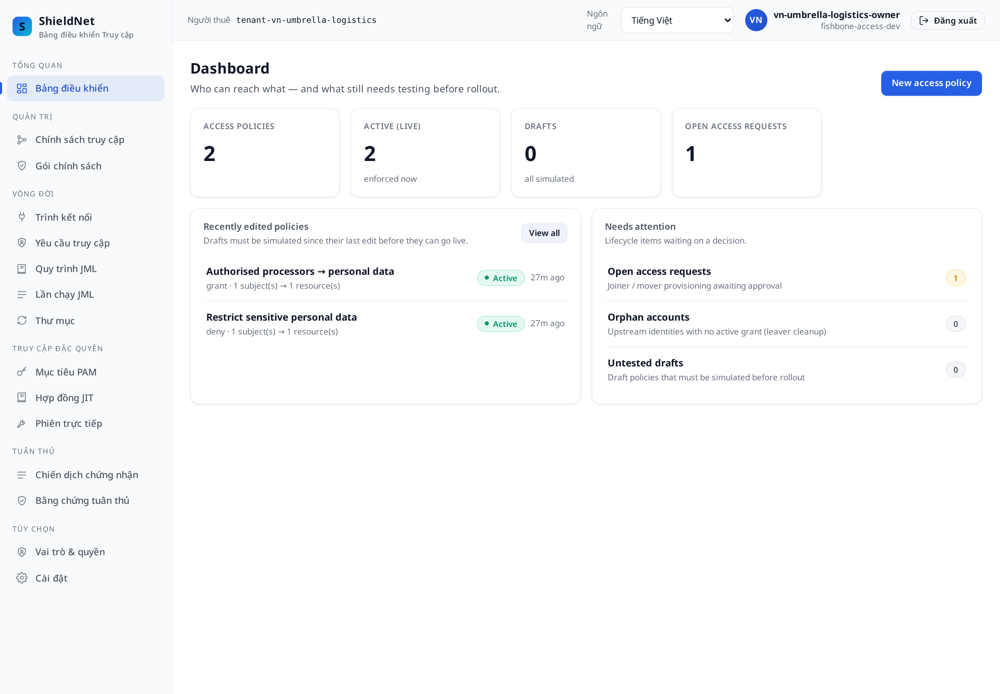
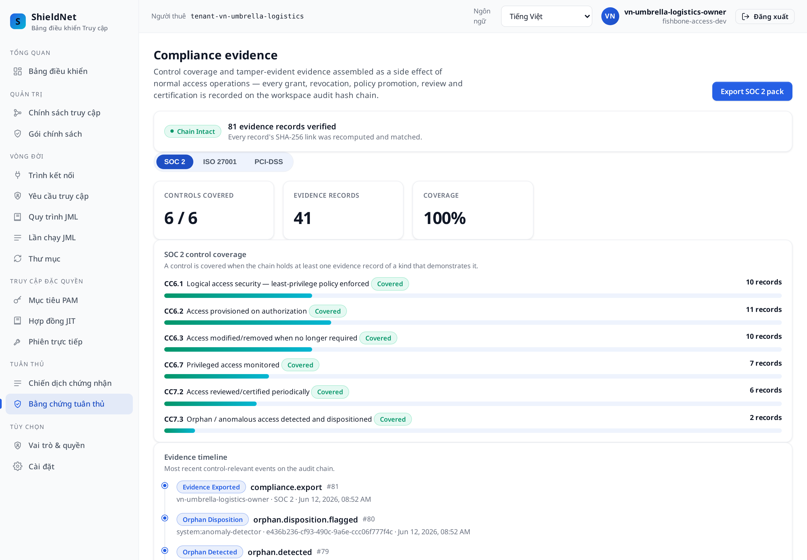
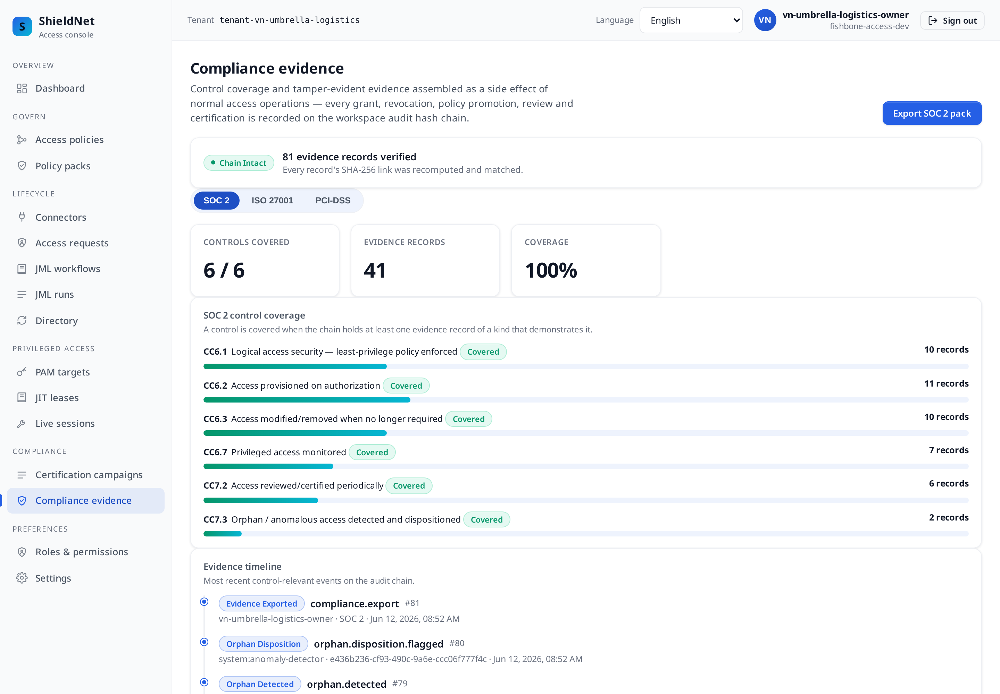

# Post 4 — Vietnam logistics: a credible "day one" posture under PDPD Decree 13

> Workspace: **Umbrella Logistics** (`vn`, logistics) · Personas: **Priya**
> (compliance officer), **Marcus** (CISO). Payloads verbatim from
> [`../artifacts/payloads/`](../artifacts/payloads/).

## The business problem

Umbrella Logistics is an emerging-market logistics SME. Vietnam's **PDPD —
Personal Data Protection Decree 13/2023**, enforced by the Ministry of Public
Security (A05), is new, and most local mid-market companies are starting from
*nothing*: no access policy, no review cadence, no evidence. The question isn't
"how do we satisfy four frameworks" (Post 3) — it's "**how do we stand up a
credible posture from one pack, this week**, that we can show a regulator?"

This is the **day-one** story, and it's deliberately the smallest workspace in
the series: **2 active policies**. The value isn't breadth — it's that even a
minimal, single-pack start produces a *verifiable* chain.

## One pack, two policies, real principles

Umbrella applies a single pack, `vn-pdpd-decree13`. It is small and to the point
([`s4-vn-umbrella-logistics-packs.json`](../artifacts/payloads/s4-vn-umbrella-logistics-packs.json)):

```
PACK: vn-pdpd-decree13 — "Vietnam — PDPD (Decree 13/2023)"
      authority: Ministry of Public Security (A05) · frameworks: PDPD, Decree 13
  • grant  "Authorised processors → personal data"
           control: Decree 13 Art. 3 — Processing principles
  • deny   "Restrict sensitive personal data"
           control: Decree 13 Art. 2(4) — Sensitive personal data
```

Two templates, two cited articles of the Decree. The `grant` encodes the
*authorised-processor* principle (Art. 3); the `deny` encodes the
*sensitive-personal-data* restriction (Art. 2(4)). That's the entire starting
posture — and it's enough to begin generating evidence.



The fabric is equally lean: **GitHub** (logistics platform), **Slack**
(operations), and a **manual warehouse-WMS** target. The WMS has no API; the
manual connector still provisions and revokes it locally so the lifecycle is
whole.

## Small posture, full lifecycle, verifiable chain

Even with two policies, Umbrella runs the *complete* lifecycle: a dispatcher and
an inventory clerk are provisioned, a Decree-13 register review request is filed,
a PDPD access review runs and makes real decisions, and a certification campaign
closes.

The PDPD review certified one grant and revoked another
([`s4-vn-umbrella-logistics-review-report.json`](../artifacts/payloads/s4-vn-umbrella-logistics-review-report.json)):

```json
{
  "report": {
    "name": "Q2 2026 PDPD Decree 13 access review",
    "total": 2, "certified": 1, "revoked": 1, "state": "active"
  }
}
```

The campaign closed, every item decided
([`s4-vn-umbrella-logistics-campaign-report.json`](../artifacts/payloads/s4-vn-umbrella-logistics-campaign-report.json)):

```json
{ "name": "Q2 2026 PDPD Decree 13 certification", "state": "closed", "all_decided": true, "total": 1, "revoked": 1 }
```

And the chain — **63 records, valid** — is the artifact that turns "we have a
policy" into "we can prove it"
([`s4-vn-umbrella-logistics-chain-verify.json`](../artifacts/payloads/s4-vn-umbrella-logistics-chain-verify.json)):

```json
{ "length": 63, "ok": true, "status": "valid", "workspace_id": "5f4754d7-24a6-4a11-80f8-2c1da580c442" }
```

That's the day-one win: a Vietnamese SME with *two policies* still produces a
tamper-evident, hash-linked record of every grant, review, and revocation — the
exact thing A05 will ask to see.

## Even the minimal posture covers the hard access cases

"Day one" does not mean "SaaS grants only." Even Umbrella's lean setup exercises
the three access patterns that trip up most SMEs:

- **Privileged access** to the warehouse-management server is a JIT SSH lease,
  not a shared root password
  ([`s4-vn-umbrella-logistics-pam-targets.json`](../artifacts/payloads/s4-vn-umbrella-logistics-pam-targets.json)):
  ```json
  { "name": "WMS application server (wms-1)", "protocol": "ssh",
    "address": "wms-1.umbrella.internal:22", "username": "wms-ops",
    "require_mfa": true, "lease_ttl_seconds": 1800 }
  ```
- **Contractor access** for a third-party-logistics partner — and this one tells
  the *whole* time-box story, because it was **revoked early** rather than left to
  expire ([`s4-vn-umbrella-logistics-contractor-grants.json`](../artifacts/payloads/s4-vn-umbrella-logistics-contractor-grants.json)):
  ```json
  { "display_name": "3PL partner operator", "contractor_user_id": "ext-3pl-partner@logistics.example",
    "resource_ref": "wms:dispatcher", "role": "operator", "sponsor_id": "vn-admin", "state": "revoked" }
  ```
- **Separation of duties**: a dispatcher must not also adjust inventory (the
  shrinkage-fraud pattern in logistics). The rule is `medium` severity, so the
  simulation *surfaces* the violation but — honestly — does **not** escalate it to
  `catastrophic` the way the `critical` rules in Posts 1, 3 and 5 do; only
  high/critical toxic combinations hard-block. Umbrella can see the medium
  conflict and decide, rather than being stopped outright
  ([`s4-vn-umbrella-logistics-sod-rules.json`](../artifacts/payloads/s4-vn-umbrella-logistics-sod-rules.json)).

The point stands: the posture is *small*, but the access *primitives* are the
full set. A two-policy tenant still gets JIT privileged leases, a **recorded**
privileged session (`pam_sessions = 1`), a **standing SoD anomaly**
(`sod_anomalies = 1`), time-boxed contractor grants, and SoD simulation — on the
same verifiable chain.

## Vietnamese, natively

The compliance evidence view in Vietnamese (locale `vi`) — same chain, translated
UI. For a logistics operator whose compliance lead works in Vietnamese, this is
not a nicety; it's whether the control is understood:



The same page in English, for reference:



Even from one pack, the framework projection still runs — SOC 2 now reads 6 / 6,
including `CC6.7` (the recorded session) and `CC7.3` (the standing SoD anomaly)
that the first cut showed empty.

## Where we fall short

- **Two policies is a *start*, not a program.** The single PDPD pack covers the
  core processing principles, but a mature posture needs role-specific grants per
  warehouse, per route, per data category. fishbone-access makes the start
  credible; it does not pretend two policies are a finished control set.
- **`CC6.7` and `CC7.3` are now covered — with the series-wide caveats.** The
  recorded session is real, replayable and chained but runs against a bastion
  target (representative commands, not a live `wms-ops` box); the `CC7.3` evidence
  is a *standing declared-rule* SoD anomaly, not behavioural orphan analytics (the
  orphan scan ran and found 0).
- **PDPD is young; the pack is our interpretation.** The templates cite Decree 13
  articles, but Vietnam's enforcement guidance is still settling. A local DPO
  should review the mapping — we give a defensible starting point, not legal
  advice.

## How a buyer should compare this

For an emerging-market SME, most of the "leaders" simply aren't realistic:

| Capability | fishbone-access | SailPoint / Saviynt | Okta IGA | CyberArk |
| --- | --- | --- | --- | --- |
| Realistic for a 2-policy, day-one SME | ✅ | ❌ enterprise floor | ⚠️ | ❌ |
| PDPD Decree 13 pack out of the box | ✅ | ❌ | ❌ | ❌ |
| Vietnamese UI | ✅ | ❌ | ⚠️ | ❌ |
| Verifiable evidence chain from 2 policies | ✅ | ⚠️ overkill | ⚠️ | ⚠️ |
| Total cost realistic for the market | ✅ | ❌ | ⚠️ | ❌ |

**The honest read:** SailPoint, Saviynt, and CyberArk are extraordinary products
— and completely the wrong shape for a Vietnamese logistics SME standing up its
*first* access posture under a *new* law. Their enterprise floor (price,
deployment, expertise) exceeds the whole problem. Okta IGA is closer but still
expects you to author the jurisdiction logic yourself. fishbone-access's edge
here is precisely that it makes a *small* start *credible*: one PDPD pack, a full
lifecycle, a valid 81-record chain, in Vietnamese, this week. The right tool is
the one that meets the company where it actually is.

---

*Next: [Post 5 — UAE finance](05-uae-finance-pdpl-desc-pam.md): privileged access
to core banking, the PAM story, and where we most clearly need CyberArk — in
Arabic, right-to-left.*
