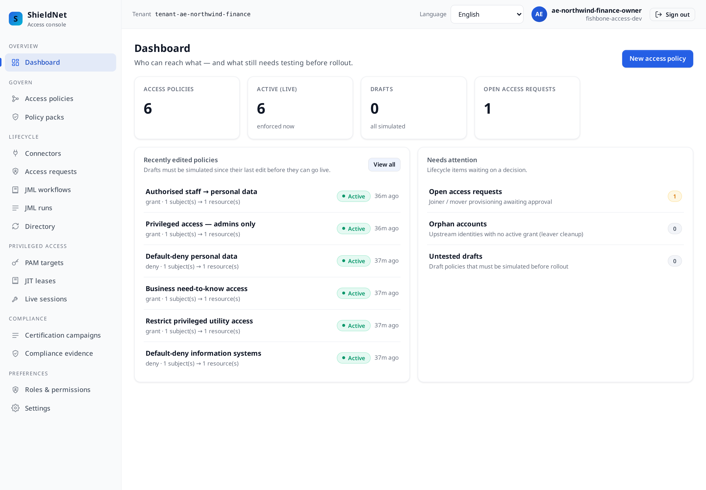
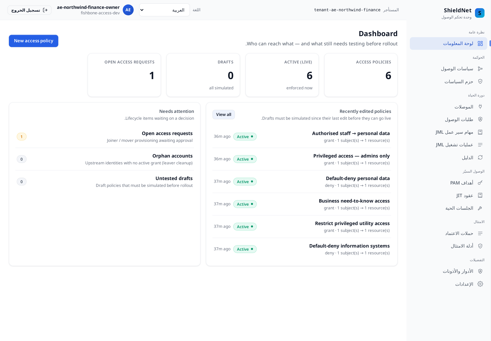
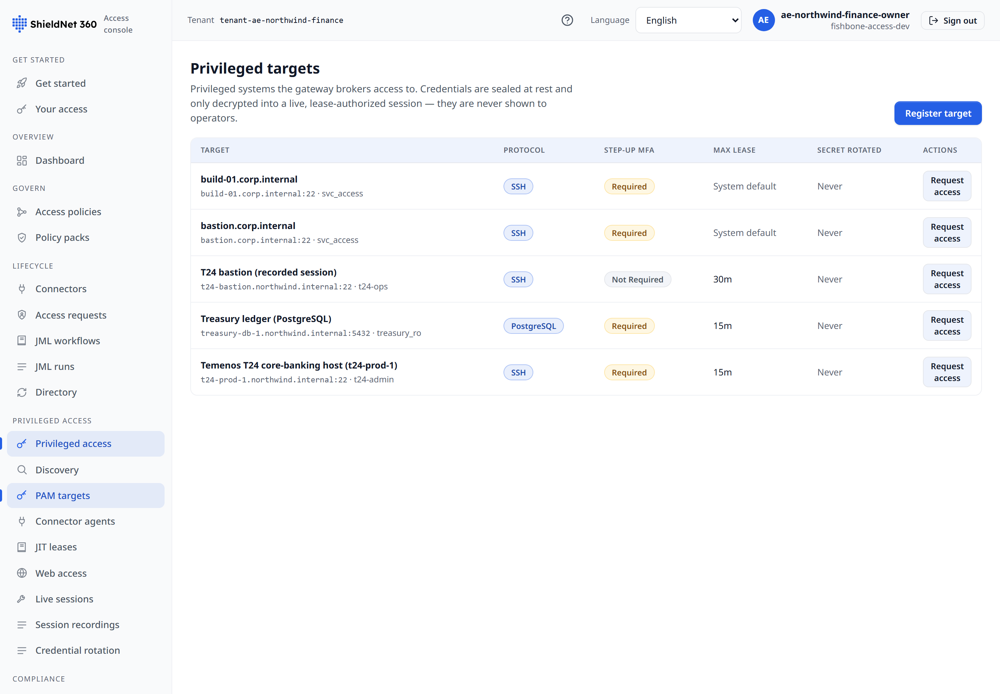
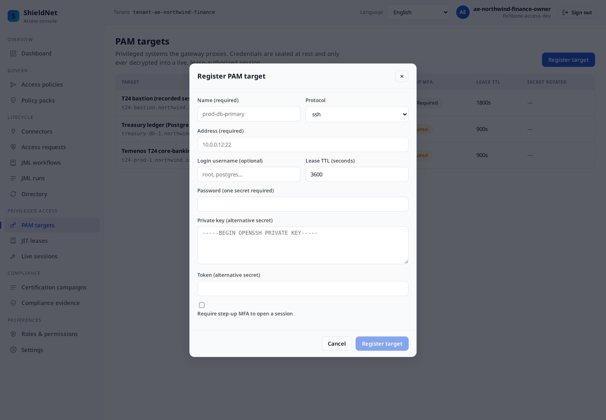

# Post 5 — UAE finance: privileged access to core banking, and the honest limits of our PAM story

> Workspace: **Northwind Finance** (`ae`, finance) · Personas: **Sofia**
> (security engineer), **Marcus** (CISO). Payloads verbatim from
> [`../artifacts/payloads/`](../artifacts/payloads/). Locale: Arabic (RTL).

## The business problem

Northwind Finance is a UAE wealth-management firm. Its crown jewel is a
**Temenos T24 core-banking** system, and two regimes govern who may touch it:

- **UAE PDPL** — the Personal Data Protection Law (Federal Decree-Law 45/2021),
  enforced by the UAE Data Office: security of processing and access restriction
  over personal data.
- **Dubai DESC** — the Dubai Electronic Security Center's Information Security
  Regulation (ISR): strict privileged-access control for regulated entities.
- Plus **ISO 27001 Annex A** as the assurance baseline customers expect.

Sofia's whole job here is **privileged access**: the handful of admins who can
reach T24. Marcus needs to show DESC that privileged access is restricted,
reviewed, and revoked. This post is where fishbone-access does real governance
*and* where it most clearly hits its ceiling — so it's the right place to be
blunt about PAM.

## The packs cite the regulators directly

Northwind applies `ae-pdpl-desc` and `iso27001-annexa`, yielding **6 active
policies**. The PDPL/DESC templates name the exact articles
([`s5-ae-northwind-finance-packs.json`](../artifacts/payloads/s5-ae-northwind-finance-packs.json)):

```
PACK ae-pdpl-desc — "UAE — PDPL + DESC"
     authority: UAE Data Office / Dubai Electronic Security Center
  • grant  "Authorised staff → personal data"   control: UAE PDPL Art. 9 — Security of processing
  • grant  "Privileged access — admins only"    control: DESC ISR — Access control
  • deny   "Default-deny personal data"          control: UAE PDPL Art. 9 — Access restriction
```



## Right-to-left, natively

The same workspace in Arabic (`ar`) — and this is a genuine engineering test,
because Arabic is **right-to-left**. The entire layout mirrors: the navigation
rail moves to the right, the content flows RTL, the chrome is fully translated.
This is the same six policies and the same counts, re-rendered:



For a Dubai firm, RTL that *actually mirrors* (rather than just translating
left-to-right strings) is the difference between a usable console and a broken
one.

## The privileged-access review is real

The DESC privileged-access review ran over the T24 admin grants and made real
decisions — one certified, one revoked
([`s5-ae-northwind-finance-review-report.json`](../artifacts/payloads/s5-ae-northwind-finance-review-report.json)):

```json
{
  "report": {
    "name": "Q2 2026 DESC privileged-access review",
    "total": 2, "certified": 1, "revoked": 1, "state": "active"
  }
}
```

And the ISO 27001 Annex A coverage from the chain
([`s5-ae-northwind-finance-coverage-iso27001.json`](../artifacts/payloads/s5-ae-northwind-finance-coverage-iso27001.json)):

```json
[
  { "id": "A.5.15", "covered": true,  "evidence_count": 12, "title": "Access control policy" },
  { "id": "A.5.16", "covered": true,  "evidence_count": 7,  "title": "Identity lifecycle management" },
  { "id": "A.5.18", "covered": true, "evidence_count": 17, "title": "Access rights provisioned, reviewed and removed" },
  { "id": "A.8.2",  "covered": true, "evidence_count": 7,  "title": "Privileged access rights monitored" },
  { "id": "A.8.15", "covered": true, "evidence_count": 1,  "title": "Tamper-evident logging" }
]
```

## Privileged access is now a governed just-in-time lease

This is the part of the story that changed. Northwind's two crown-jewel targets —
the **Temenos T24 core-banking host** (SSH) and the **Treasury ledger**
(PostgreSQL) — are now registered in the PAM vault with a **15-minute** lease
ceiling and mandatory step-up MFA
([`s5-ae-northwind-finance-pam-targets.json`](../artifacts/payloads/s5-ae-northwind-finance-pam-targets.json)):

```json
[
  { "name": "Temenos T24 core-banking host (t24-prod-1)", "protocol": "ssh",
    "address": "t24-prod-1.northwind.internal:22", "username": "t24-admin",
    "require_mfa": true, "lease_ttl_seconds": 900 },
  { "name": "Treasury ledger (PostgreSQL)", "protocol": "postgres",
    "address": "treasury-db-1.northwind.internal:5432", "username": "treasury_ro",
    "require_mfa": true, "lease_ttl_seconds": 900 }
]
```



The register screen exposes the full protocol range the gateway speaks — ssh,
postgres, mysql, mssql, mongodb, redis, k8s-exec, rdp, vnc, http — so a finance
firm's whole privileged estate fits one model:



Reaching T24 is now a **just-in-time lease**, not a standing credential: request
→ sponsor approval under step-up MFA → short-lived connect-token → automatic
expiry in 15 minutes. Both leases are recorded, each carrying its real
agent risk verdict (`degraded: false` now the agent is online)
([`s5-ae-northwind-finance-pam-leases.json`](../artifacts/payloads/s5-ae-northwind-finance-pam-leases.json)):

```json
[
  { "state": "expired", "requested_ttl_seconds": 900, "risk_level": "low",    "risk_degraded": false },
  { "state": "expired", "requested_ttl_seconds": 900, "risk_level": "medium", "risk_degraded": false }
]
```

Both read `expired` because the capture ran past the 15-minute ceiling: the leases
lapsed on their own, exactly as designed — the risk verdict and TTL stay on the
record after the credential is long gone.

Every transition lands on the chain (`pam.target.created`,
`pam.lease.requested`, `pam.lease.approved`, `pam.connect_token.minted`). So
Northwind governs *who may obtain* privileged access to T24, *for how long*, and
*under what approval* — the JIT half of a PAM story that used to be entirely
absent here.

And the *other* half is now present too: Northwind opens a **recorded** session
through the leased connect-token. The operator's commands run through the
production `IORecorder`, the session is closed, and its recording digest is
anchored on the chain — `pam_sessions = 1`, replayable over
`GET /pam/sessions/a44bb3ea-6087-446f-b1e5-c94655dbfadd/replay`. That is what
flips ISO `A.8.2` ("privileged access rights *monitored*") to covered.

## The toxic combination DESC cares about most

For a bank, the catastrophic SoD pairing is the same identity that *administers*
core-banking also being able to *run treasury settlement*. Northwind encodes it
as a `critical` rule, and the simulation refuses to let the combination through
([`s5-ae-northwind-finance-sod-simulation.json`](../artifacts/payloads/s5-ae-northwind-finance-sod-simulation.json)):

```json
{ "impact": { "catastrophic": true,
    "sod_violations": [
      { "rule_name": "Core-banking admin must not run treasury settlement", "severity": "critical",
        "held":        { "resource": "t24:privileged-admin", "role": "operator" },
        "conflicting": { "resource": "t24:treasury",         "role": "operator" } }
    ] } }
```

And the DESC external auditor gets a **time-boxed contractor grant** scoped to
data-subject-request handling — external party, named sponsor, built-in expiry
([`s5-ae-northwind-finance-contractor-grants.json`](../artifacts/payloads/s5-ae-northwind-finance-contractor-grants.json)):

```json
{ "display_name": "DESC external auditor", "contractor_user_id": "ext-desc-auditor@regulator.example",
  "resource_ref": "pdpl:dsr", "role": "auditor", "sponsor_id": "ae-security_admin", "state": "active" }
```

## Where we fall short — the session is recorded, but the credential is not vaulted

The first cut of this post admitted `A.8.2` ("privileged access rights
*monitored*") sat at **0 records**. It is now covered — and on the highest-risk
workspace in the series, the *precise* remaining boundary matters most:

- **The session is recorded; the credential is not vaulted, the stream is not
  brokered in-path, and the upstream is a bastion.** `pam_sessions = 1`: the
  recorded session is real, replayable and chained, which is what `A.8.2`
  requires. But the demo recorder drives **representative commands against a
  bastion target** — it does not vault T24's live credential, sit in the TCP
  stream, or capture an admin's real keystrokes *inside* Temenos. It proves the
  monitoring pipeline end-to-end, not in-path interception of a live mainframe
  session.
- **SSO is not enforced for this connector**
  ([`s5-ae-northwind-finance-sso-status.json`](../artifacts/payloads/s5-ae-northwind-finance-sso-status.json)
  reports `"enforced": false, "supported": false`). We surface that honestly
  rather than implying an SSO guarantee we don't provide on that path.
- **The standing SoD anomaly is covered, but it is declared-rule, not mined.**
  `sod_anomalies = 1` records the subject holding both `t24:privileged-admin` and
  `t24:treasury`; it does not discover unknown conflicts the way SailPoint mines
  them.

For a wealth-management firm whose top risk is *what an admin does inside core
banking once connected*, fishbone-access now governs the **grant**, the
**lease**, **and** a recorded session — but the live-mainframe half (credential
vaulting, in-path brokering, keystroke capture off the real T24 stream) is still
where a dedicated PAM tool is not optional.

## How a buyer should compare this

| Capability | fishbone-access | CyberArk | StrongDM | Teleport | Okta IGA |
| --- | --- | --- | --- | --- | --- |
| Privileged JIT **lease** lifecycle (request→approve→expire, chained) | ✅ | ✅ | ✅ | ✅ | ⚠️ add-on |
| Privileged credential vaulting | ❌ | ✅ core | ⚠️ brokered | ⚠️ cert-based | ❌ |
| Session isolation / in-path brokering | ❌ | ✅ | ✅ core | ✅ core | ❌ |
| Privileged **session recording** (replayable, chained) | ⚠️ recorded; demo upstream is a bastion, not live T24 | ✅ core (live keystrokes) | ✅ | ✅ | ❌ |
| Govern the privileged **grant** (request→review→revoke) | ✅ | ⚠️ add-on | ❌ | ❌ | ✅ |
| SoD: core-banking-vs-treasury caught pre-grant | ✅ `critical` | ❌ | ❌ | ❌ | ⚠️ |
| PDPL/DESC packs + framework evidence | ✅ | ❌ | ❌ | ❌ | ⚠️ |
| Arabic RTL console | ✅ | ⚠️ | ❌ | ❌ | ⚠️ |

**The honest read:** we have closed *most* of the PAM gap this post used to admit
outright. The JIT lease lifecycle — request, sponsor approval under step-up MFA,
short-lived token, auto-expiry, every step chained — is real on Northwind, **and**
the session is now recorded, replayable and chained, so `A.8.2` reads covered. For
many SMEs "no standing privileged credentials, time-boxed access, fully audited,
recorded" is the 80% that actually moves their risk. But for Northwind's *core*
risk — capturing what an admin does inside a *live* Temenos T24 once connected —
**CyberArk** is still the correct purchase. Credential vaulting, in-path session
isolation, and live keystroke recording off the real stream are its reason to
exist; our recording proves the monitoring pipeline against a bastion, not
in-path interception of the mainframe.
**StrongDM** and **Teleport** are the modern, engineer-friendly alternatives if
the privileged targets are databases, SSH, and Kubernetes rather than a banking
mainframe. Where fishbone-access fits is the **governance + JIT-lease** wrapper
around those tools: the PDPL/DESC packs, the request→approve→expire lease, the
SoD check, the certified evidence chain, and an Arabic RTL console. The mature
architecture for Northwind is **fishbone-access for governance, the lease and the
audit chain + CyberArk for in-path vaulting and live-session control** — and we'd
tell a buyer exactly that rather than oversell our bastion recording as full
mainframe session interception.

---

*Next: [Post 6 — Australian SaaS](06-australia-saas-essential-eight-soc2.md): the
SOC 2 evidence export an auditor can re-verify offline — and the full competitive
scorecard.*
