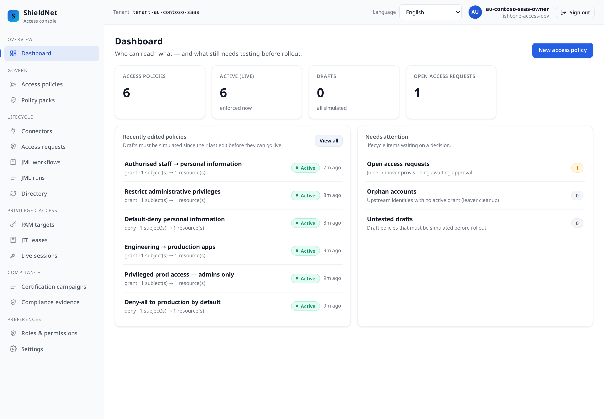
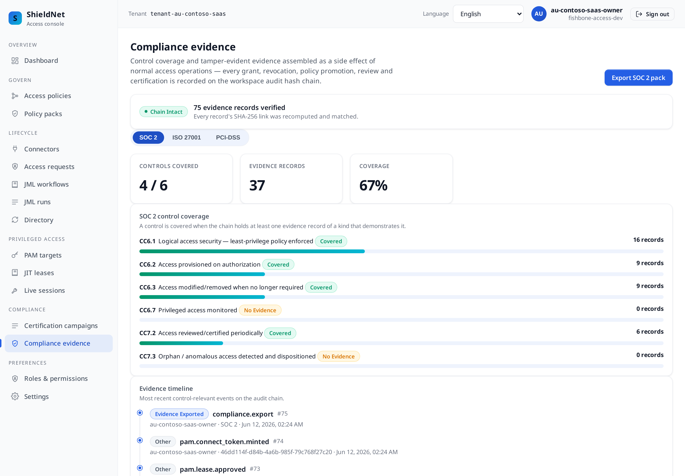

# Post 6 — Australian SaaS: a SOC 2 evidence pack an auditor can re-verify offline

> Workspace: **Contoso SaaS** (`au`, saas) · Personas: **Marcus** (CISO),
> **Aisha** (external auditor). Payloads verbatim from
> [`../artifacts/payloads/`](../artifacts/payloads/). This is the finale and the
> full competitive scorecard.

## The business problem

Contoso is an Australian SaaS vendor. To sell upmarket it must pass a **SOC 2
Type II** audit, and to satisfy local expectations it maps to the ACSC
**Essential Eight** — specifically *restrict administrative privileges*. The
whole sale hinges on one moment: an auditor (Aisha) asks for evidence, and
Contoso must hand her something she can **verify herself**, offline, without
trusting Contoso's dashboard.

That artifact — a re-verifiable evidence pack — is what this post is about, and
it's the capability that most cleanly separates fishbone-access from a pile of
screenshots in a shared drive.

## The setup

Contoso applies `au-privacy-e8` and `soc2-logical-access`, yielding **6 active
policies** over **GitHub** (product eng), **GCP** (production), **Slack**
(engineering), and a **manual billing-console** target. The policy names tell the
Essential-Eight story directly — *Restrict administrative privileges*,
*Privileged prod access — admins only*, *Deny-all to production by default*.



Contoso then runs the lifecycle: RevOps and time-boxed deploy grants, a SOC 2
evidence-sampling auditor request, a SOC 2 Type II recertification review, and a
**closed SOC 2 certification campaign**.

## The export — the moment that matters

On the **Compliance evidence** page, Contoso clicks **Export SOC 2 pack**. Two
things happen that you can see in the live console:

1. A ZIP downloads (here, `evidence-pack-SOC_2.zip`).
2. A toast confirms **"Evidence pack exported — Digest `b67b19a7dd61…` recorded
   on the audit chain"**, and the export *itself* appears as a new
   `compliance.export` event on the timeline (record `#75` in the screenshot).



The export is **step-up-MFA-gated** — it consumes a fresh TOTP code, the same
strongest-gate treatment as policy promotion — and it is *self-recording*:
exporting evidence is itself an evidence event. The page header confirms the
chain is **intact** and every record's SHA-256 link was recomputed and matched.

## What's in the pack — and why Aisha trusts it

The committed manifest is the contract
([`s6-au-contoso-saas-evidence-pack-manifest.json`](../artifacts/payloads/s6-au-contoso-saas-evidence-pack-manifest.json)):

```json
{
  "framework": "SOC 2",
  "schema_version": "1.0",
  "generated_by": "au-contoso-saas-owner",
  "content_sha256": "b67b19a7dd61ae7bf6f3e0dc8d095e67b8467fe2259e323dd6f087e1d71eb8fe",
  "chain_verification": { "length": 74, "ok": true, "status": "valid" },
  "coverage": { "framework": "SOC 2", "controls_covered": 4, "controls_total": 6, "evidence_total": 36 },
  "files": [
    { "name": "evidence.jsonl",              "rows": 74 },
    { "name": "pam-recordings.jsonl",        "rows": 0 },
    { "name": "access-grants.jsonl",          "rows": 4 },
    { "name": "certification-campaigns.jsonl","rows": 1 },
    { "name": "certification-items.jsonl",    "rows": 1 },
    { "name": "policies.jsonl",               "rows": 6 },
    { "name": "control-coverage.json",        "rows": 0 },
    { "name": "chain-verification.json",      "rows": 0 },
    { "name": "README.md",                    "rows": 0 }
  ]
}
```

Each file in the manifest also carries its own SHA-256. So Aisha's verification
is mechanical and needs **zero trust in Contoso**:

1. Re-hash each file → compare to the per-file `sha256` in the manifest.
2. Re-hash the whole pack → compare to `content_sha256`.
3. Replay `evidence.jsonl`'s hash chain → confirm it matches
   `chain-verification.json` (`length: 74, status: valid`).

If a single byte of any evidence record was altered after the fact, a link
breaks and the chain fails. That's the difference between "here are some
screenshots" and "here is a tamper-evident record you can independently verify."

> Note on the numbers: the committed manifest shows `length: 74` (captured at
> the moment of export); the live screenshot shows **75** because a subsequent
> export appended one more `compliance.export` event to the chain. Both are
> honest — the chain simply grew by that export, and each new export re-verifies
> the whole chain before writing its own record. (The manifest also now ships a
> `pam-recordings.jsonl` file — empty here, because `pam_sessions = 0`; the pack
> carries the slot even when the demo has nothing to put in it.)

## What the export actually covers — the full access surface

The reason the pack is more than policies is that Contoso runs the *whole* access
surface through the chain before exporting it:

- **PAM to production** is a JIT lease, not a shared key. The production
  PostgreSQL datastore and the GCP production VM are registered targets
  ([`s6-au-contoso-saas-pam-targets.json`](../artifacts/payloads/s6-au-contoso-saas-pam-targets.json)):
  ```json
  [
    { "name": "Production datastore (PostgreSQL)", "protocol": "postgres",
      "address": "prod-db-1.contoso-saas.internal:5432", "username": "app_ro", "require_mfa": true },
    { "name": "GCP production VM (prod-au-1)", "protocol": "ssh",
      "address": "prod-au-1.contoso-saas.internal:22", "username": "sre", "require_mfa": true }
  ]
  ```
- **The Essential-Eight "restrict admin privileges" control becomes a SoD rule**:
  whoever can deploy to production must not also hold billing-admin. The
  simulation flags the combination `catastrophic` before it lands
  ([`s6-au-contoso-saas-sod-simulation.json`](../artifacts/payloads/s6-au-contoso-saas-sod-simulation.json)).
- **The on-call SRE vendor** is a time-boxed contractor grant — sponsor named,
  expiry built in ([`s6-au-contoso-saas-contractor-grants.json`](../artifacts/payloads/s6-au-contoso-saas-contractor-grants.json)):
  ```json
  { "display_name": "On-call SRE vendor", "contractor_user_id": "ext-sre-oncall@vendor.example",
    "resource_ref": "prod:deploy", "role": "operator", "sponsor_id": "au-admin", "state": "active" }
  ```

All of it — PAM leases, the contractor grant, the SoD-checked policy promotions,
the certification — is on the *same* hash chain the export re-verifies. That is
the point: the evidence pack is a single, tamper-evident record of the entire
access lifecycle, not a folder of disconnected reports.

## Where we fall short — the same two gaps, named one last time

Contoso's SOC 2 coverage is **4 / 6**, and the two uncovered controls are the
recurring honest limits of the entire product:

- **`CC6.7` "Privileged access monitored" — 0 records.** The JIT lease to the
  prod DB/VM above is governed and chained, but `pam_sessions = 0`: no in-path
  session proxy, no keystroke recording. We govern the *lease*, not the *session*.
  (Post 5 is the full version of this gap.)
- **`CC7.3` "Orphan / anomalous access detected and dispositioned" — 0 records.**
  We *detect* orphans (the scan ran and found 0), but we don't run behavioural
  anomaly analytics, so there's no dispositioned-anomaly event to evidence the
  control.

A SOC 2 auditor will note both. fishbone-access gives Contoso a defensible 4/6
with a re-verifiable pack and a clear, honest list of what it does **not** cover
— which is far stronger than a tool that claims 6/6 by mapping controls
loosely.

## The full competitive scorecard

Across the whole series, here is the honest positioning:

| Capability | fishbone&#8209;access | Okta IGA | SailPoint | Saviynt | CyberArk | Teleport | StrongDM |
| --- | :---: | :---: | :---: | :---: | :---: | :---: | :---: |
| Jurisdiction/framework packs out of the box | ✅ | ⚠️ | ⚠️ | ⚠️ | ❌ | ❌ | ❌ |
| One chain → many framework maps | ✅ | ⚠️ | ⚠️ | ⚠️ | ❌ | ❌ | ❌ |
| Tamper-evident, **re-verifiable** evidence export | ✅ | ⚠️ | ⚠️ | ⚠️ | ⚠️ | ⚠️ | ⚠️ |
| Step-up MFA on promote, export **and** lease approval | ✅ | ⚠️ | ⚠️ | ⚠️ | ✅ | ⚠️ | ⚠️ |
| Access certifications / campaigns | ✅ | ✅ | ✅✅ | ✅✅ | ⚠️ | ❌ | ❌ |
| AI-assisted risk on requests/leases (fail-safe degraded) | ✅ | ⚠️ | ✅ | ✅ | ❌ | ❌ | ❌ |
| Time-boxed contractor access (sponsor + auto-expiry) | ✅ | ⚠️ | ✅ | ✅ | ❌ | ⚠️ | ⚠️ |
| SoD toxic-combo check at simulation (rule-based) | ✅ | ⚠️ | ✅✅ | ✅✅ | ❌ | ❌ | ❌ |
| SoD entitlement-mining **analytics** at scale | ⚠️ | ⚠️ | ✅✅ | ✅✅ | ❌ | ❌ | ❌ |
| Orphan/anomaly **analytics** | ❌ | ⚠️ | ✅ | ✅ | ❌ | ⚠️ | ⚠️ |
| Privileged JIT **lease** lifecycle (request→approve→expire) | ✅ | ⚠️ | ⚠️ | ⚠️ | ✅ | ✅ | ✅ |
| Privileged credential vaulting | ❌ | ❌ | ❌ | ⚠️ | ✅✅ | ⚠️ | ⚠️ |
| Live privileged **session recording** | ❌ | ❌ | ❌ | ⚠️ | ✅✅ | ✅ | ✅ |
| Infra (DB/SSH/k8s) access brokering (in-path) | ❌ | ❌ | ❌ | ❌ | ⚠️ | ✅✅ | ✅✅ |
| Multi-locale incl. RTL | ✅ | ⚠️ | ⚠️ | ⚠️ | ⚠️ | ❌ | ❌ |
| SME fit (one console, days→weeks) | ✅ | ⚠️ | ❌ | ❌ | ❌ | ✅ | ✅ |

✅✅ = category leader · ✅ = strong · ⚠️ = partial / add-on / build-it-yourself · ❌ = not the tool's job

### How to read it

- **If your risk is recording the privileged *session*** (keystrokes inside
  core-banking, a prod DB, Kubernetes): **CyberArk** (vault + session), or
  **Teleport / StrongDM** for modern infra access. We now govern the JIT *lease*
  to those targets — request, approve, expire, all chained — but we are not in
  the connection path recording the session, so pair us with one of these for the
  recording half.
- **If your risk is *toxic combinations* across thousands of *un-enumerated*
  entitlements:** **SailPoint** or **Saviynt**. We catch *declared* toxic
  combinations at simulation time (the `catastrophic` verdict in Posts 1, 3, 5),
  but their entitlement-*mining* finds the conflicts nobody wrote down — and their
  orphan/anomaly analytics are the `CC7.3` gap we openly don't fill.
- **If your risk is *proving framework compliance fast, as an SME*, across
  jurisdictions, with evidence an auditor can re-verify — over the full access
  surface (SaaS, internal systems, JIT-privileged DB/VM, contractors, JML):**
  that's our lane — PDPA/HIPAA/BDSG/PDPD/PDPL/Essential-Eight packs,
  one-chain-many-maps, AI-risk-scored requests, a governed privileged-lease flow,
  time-boxed contractor access, and a step-up-gated re-verifiable export, in 12
  locales including RTL, in one console.

**The honest conclusion:** fishbone-access is not trying to out-record CyberArk's
session vault or out-mine SailPoint's entitlement analytics, and this series has
shown — with real 0-record coverage cells (`CC6.7`, `CC7.3`) and honestly
*degraded* AI-risk verdicts — exactly where those tools win. What it now covers is
broad: SaaS and internal-system access through one connector fabric, JIT
privileged leases to cloud VMs and databases, time-boxed contractor access,
AI-assisted risk on every request, SoD simulation that stops catastrophic grants,
JML with a layered leaver kill switch, and regulation-keyed certification with a
re-verifiable export. Its bet is that most SMEs don't fail audits for lack of a
session vault; they fail because they **can't prove the controls ran**. The whole
product is built to make that proof verifiable, multi-framework, multilingual, and
cheap enough for a 40-person company to stand up this quarter. Where it falls
short, the coverage map says so on screen — which is, in the end, the most honest
competitive claim of all.

---

*Next: [Post 7 — Benchmarks on this VM](07-benchmarks-on-this-vm.md): what the
live control plane actually clocks on a single dev box, with the methodology and
the caveats spelled out.*

*Reproduce everything in this series with `make blog-seed`, `make blog-capture`,
`make blog-bench`, and `make blog-test` — see [`README.md`](README.md). Every
screenshot above is a real seeded page; every payload is a verbatim capture.*
